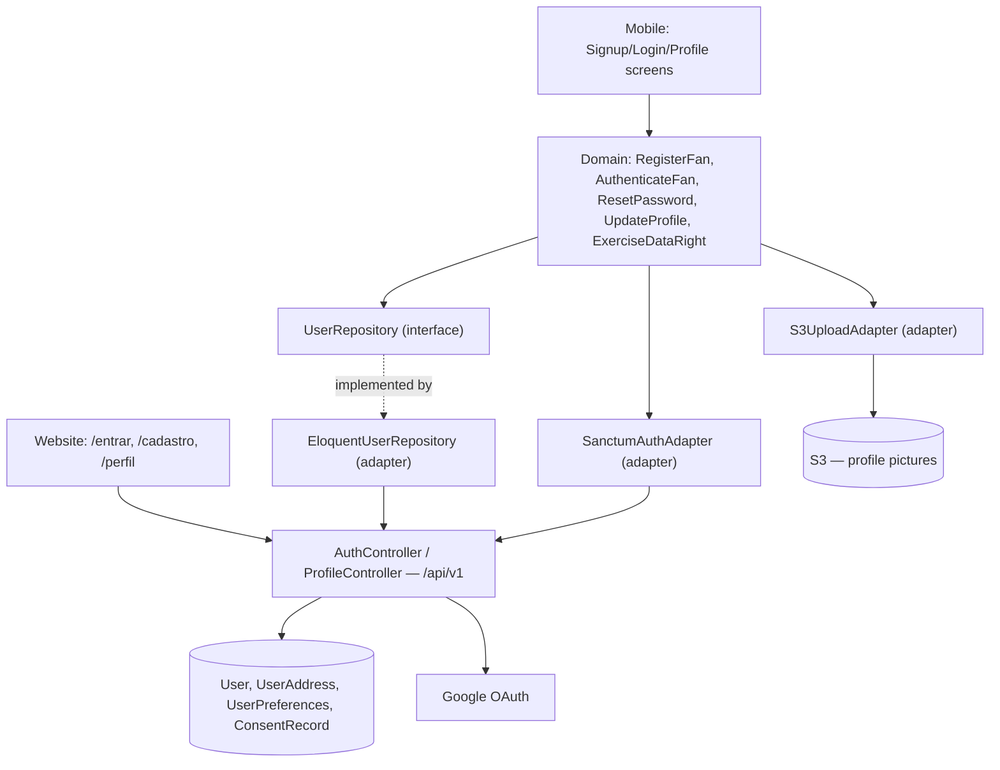

# Auth & Fan Profile Design

**Spec**: `.specs/features/auth-fan-profile/spec.md`
**Architecture**: `.specs/project/ARCHITECTURE.md` (auth mechanism §2, data models §4, LGPD hooks §7, security §13, constants/enums §14 — referenced, not repeated here)
**Status**: Draft

---

## Architecture Overview

Fan-facing auth surface under `/api/v1`, distinct Sanctum guard from the admin-panel auth in `venue-promoter-admin/design.md`.



---

## Code Reuse Analysis

### Existing Components to Leverage

| Component | Location | How to Use |
|---|---|---|
| `EventRepository`/Clean Architecture layering pattern | `event-discovery/design.md` | Same domain/adapter/UI split applied here — first feature to establish it, this one follows the same shape |
| Consent-capture UI component | Built here | Reused as-is by Venue/Promoter Admin's registration forms (`venue-promoter-admin/design.md`) — same LGPD Art. 7 acceptance step |

### Integration Points

| System | Integration Method |
|---|---|
| Google OAuth | `SanctumAuthAdapter` exchanges the Google ID token for a QOR session/token; new-account path pre-fills name/email/picture then still requires the consent step |
| S3/CDN | `S3UploadAdapter` — multipart upload from client, server-side MIME/size validation, forward to S3, store resulting URL on `User.profile_picture_url` |

---

## Components

### `User` (domain entity)
- **Purpose**: Fan account, per ARCHITECTURE.md §4 (includes `birthdate`, captured at signup per Design decision — age-gating enforcement deferred).
- **Location**: `src/Domain/User/User.php`
- **Dependencies**: none

### `RegisterFan` (domain use case)
- **Purpose**: AUTH-01–AUTH-05 — email/password signup with consent capture, duplicate-email rejection, password-strength validation.
- **Location**: `src/Domain/User/UseCase/RegisterFan.php`
- **Interfaces**: `execute(email, password, birthdate, profileFields, consentAcceptance): User`
- **Dependencies**: `UserRepository`, `ConsentRepository`

### `AuthenticateFan` (domain use case)
- **Purpose**: AUTH-06–AUTH-12 — email/password login, Google login/signup, generic-failure messaging, session issuance.
- **Location**: `src/Domain/User/UseCase/AuthenticateFan.php`
- **Interfaces**: `executeWithPassword(email, password): Session`, `executeWithGoogle(googleIdToken): Session`
- **Dependencies**: `UserRepository`, `SanctumAuthAdapter`

### `ResetPassword` (domain use case)
- **Purpose**: AUTH-13–AUTH-16 — reset-link issuance without account enumeration, link expiry/single-use enforcement.
- **Location**: `src/Domain/User/UseCase/ResetPassword.php`
- **Interfaces**: `requestReset(email): void`, `confirmReset(token, newPassword): void`
- **Dependencies**: `UserRepository`

### `UpdateProfile` (domain use case)
- **Purpose**: AUTH-17–AUTH-19 — view/edit profile fields, email-change re-verification.
- **Location**: `src/Domain/User/UseCase/UpdateProfile.php`
- **Interfaces**: `execute(userId, fields): User`
- **Dependencies**: `UserRepository`, `S3UploadAdapter` (profile picture)

### `ExerciseDataRight` (domain use case)
- **Purpose**: AUTH-25 — LGPD Art. 18 access/correct/delete/export/revoke.
- **Location**: `src/Domain/User/UseCase/ExerciseDataRight.php`
- **Interfaces**: `access(userId): DataExport`, `delete(userId): void` (cascades per ARCHITECTURE.md §7), `export(userId): PortableFile`, `revokeConsent(userId, consentType): void`
- **Dependencies**: `UserRepository`, `ConsentRepository`

### `UserRepository` (domain interface)
- **Location**: `src/Domain/User/UserRepository.php` (interface); `EloquentUserRepository` in `src/Infrastructure/Persistence/`
- **Interfaces**: `findByEmail`, `findById`, `save`, `delete` (soft, cascading)

### `AuthController` / `ProfileController` (infrastructure adapters)
- **Purpose**: HTTP boundary under `/api/v1`, fan guard only.
- **Location**: `src/Http/Controllers/Api/V1/AuthController.php`, `ProfileController.php`
- **Interfaces**: `POST /api/v1/auth/register`, `POST /api/v1/auth/login`, `POST /api/v1/auth/google`, `POST /api/v1/auth/logout`, `POST /api/v1/auth/password/forgot`, `POST /api/v1/auth/password/reset`, `GET/PATCH /api/v1/profile`, `POST /api/v1/profile/picture`, `GET/POST /api/v1/profile/data-rights/{access|export|delete|revoke}`

### Consent-capture component (UI)
- **Purpose**: Renders the Portuguese-language privacy policy/terms with a required, non-pre-checked acceptance checkbox — shared shape for fan signup, Google signup, and (reused by) Venue/Promoter registration.
- **Location**: mobile/web shared UI component; reused per-surface (Compose + Next.js each implement it, same content contract)

---

## Data Models

Reuses `User`, `UserAddress`, `UserPreferences` from ARCHITECTURE.md §4, elaborated here for this feature's needs:

```typescript
interface ConsentRecord {
  id: string
  userId: string
  consentType: ConsentType // ARCHITECTURE.md §14.1 backed enum (Terms | Location) — not a string union re-declared per feature
  policyVersion: string
  acceptedAt: Date
}
```

**Relationships**: `ConsentRecord.userId` → `User.id`. `UserAddress`/`UserPreferences` are 1:1 with `User` (P2 scope).

---

## Error Handling Strategy

| Error Scenario | Handling | User Impact (pt-BR) |
|---|---|---|
| Signup with already-registered email (either auth method) | `RegisterFan` checks both auth paths before creating | "Este e-mail já está cadastrado" — no duplicate row created |
| Password below strength policy | Server-side rule (`qor.auth.password_rules`, ARCHITECTURE.md §14.2 — not a hardcoded length in the Form Request) returns specific reason, not generic | e.g. "A senha precisa ter no mínimo {X} caracteres", X read from config |
| Login with wrong credentials | Generic message regardless of whether email exists | "Credenciais inválidas" |
| Login before email verification | Blocked, offers resend | "Confirme seu e-mail para continuar" + resend link |
| Password-reset request for unknown email | Same success message as a valid request (no enumeration) | "Se este e-mail existir, você receberá um link" |
| Expired/reused reset link | Rejected, must request new | "Link expirado ou já utilizado" |
| Email-change before re-verification | New email inactive until confirmed | Old email remains active session-wise until new one is verified |

Client-side validation before submit: signup/login forms validate required fields, email format, password minimum-length client-side (mirroring the server's strength policy) before the request fires; profile-edit form validates phone format; password-reset forms validate email format. All error copy in pt-BR.

---

## Analytics — GA4 Events

Per ARCHITECTURE.md §11/§14.4 (each event below is a named constant in the `AnalyticsEvents` registry, never a literal at the call site). Seed list — implementation gated on tracking-spreadsheet approval:

| Event | Fired when |
|---|---|
| `submit:cadastro:criar-conta` | Fan submits the email/password signup form |
| `click:login:google` | Fan taps "Entrar com Google" |
| `submit:recuperar-senha:solicitar` | Fan submits the password-reset request form |
| `submit:perfil:salvar-alteracoes` | Fan saves profile edits |
| `click:perfil:exportar-dados` | Fan requests a data export (AUTH-25) |
| `click:perfil:excluir-conta` | Fan requests account deletion (AUTH-25) |

---

## Tech Decisions (non-obvious only)

| Decision | Choice | Rationale |
|---|---|---|
| Birthdate enforcement | Captured, not enforced, in MVP Core | Design decision — cheap to collect now, avoids a schema migration later; `age_rating` on events stays informational-only for v1 |
| Location consent | Separate `ConsentRecord` row from terms acceptance | LGPD requires distinct, revocable consent for device-location use — cannot be bundled |
| Data-subject-rights deletion | Soft-delete + PII scrub, not hard delete | Preserves referential integrity for any legally-required retention window (PRD §8 Q13 — retention period still open, flagged, not resolved by this design) |
| Reset-link TTL, `consentType` values | Config key (`qor.auth.password_reset_ttl_minutes`) and backed `ConsentType` enum, ARCHITECTURE.md §14 | No hardcoded expiry duration or string-literal consent type scattered across `ResetPassword`/`ExerciseDataRight` |

---

## Requirement Coverage

AUTH-01–AUTH-19 map to `RegisterFan`/`AuthenticateFan`/`ResetPassword`/`UpdateProfile` and `AuthController`/`ProfileController`. AUTH-25 maps to `ExerciseDataRight`. AUTH-20–AUTH-24 (address/location, genres/radius, notification-preference fields) are P2 and **out of scope for this design pass** — they remain `Pending`, to be designed when the Favorites & Social / Notifications milestones start.
