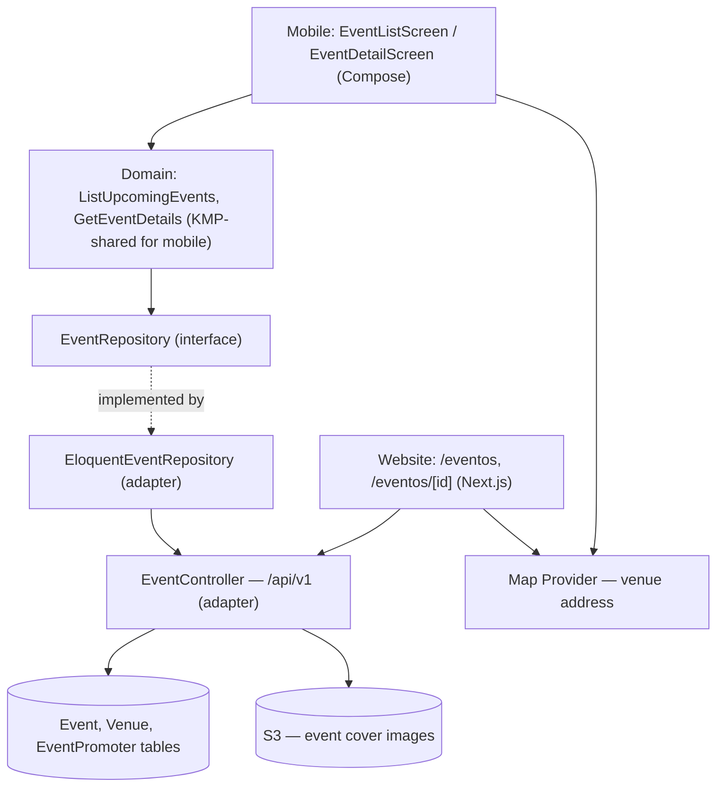

# Event Discovery Design

**Spec**: `.specs/features/event-discovery/spec.md`
**Architecture**: `.specs/project/ARCHITECTURE.md` (auth, API conventions, data models, Clean Architecture, security, localization, analytics, §14 constants/enums — all referenced, not repeated here)
**Status**: Draft

---

## Architecture Overview

Public, unauthenticated read surface. No Sanctum guard on these routes — `/api/v1/events` and `/api/v1/events/{id}` are open, since a fan can browse without an account (DISC-01–DISC-13).

**Live-update approach**: polling (short-interval refetch of the list, plus pull-to-refresh) rather than a websocket/SSE push channel. The poll interval is a named config constant (`qor.polling.event_list_interval_seconds` — client-side equivalent mirrored per §14.3), not a literal typed into each client's networking code. *(Tech Decision: no realtime infrastructure is decided elsewhere in the stack yet, and DISC-04's requirement — "reflect changes without a manual restart" — doesn't require sub-second latency. Revisit if a websocket layer gets adopted for another feature.)*

**Filtering** (DISC-14–DISC-18, pulled into P1 during Design): `city` and `genre` are query params on `GET /api/v1/events`. `city` validates against the `City` backed enum (ARCHITECTURE.md §14.1) — an unrecognized value is a 422, not silently ignored; `genre` validates against the `genres` lookup table by ID/slug, not a hardcoded list. Both combine with AND when present; omitting either returns the unfiltered soonest-first list. Filters compose with the existing cursor pagination (page size per `qor.pagination.public_page_size`, §14.2) — the cursor encodes the filtered query, not just an offset, so filtered results paginate correctly.

---

## Code Reuse Analysis

Greenfield feature — no existing code to reuse yet. This design *is* the reuse target for later features: `Event`/`Venue`/`EventPromoter` entities and the `EventRepository` interface defined here are extended (not redefined) by Venue/Promoter Admin's write-side design, and Favorites & Social will read the same `Event` entity.

### Integration Points

| System | Integration Method |
|---|---|
| S3/CDN | Read-only — event cover image URLs stored on `Event.cover_image_url`, fetched directly by client from CDN, not proxied through the API |
| Map provider | Client-side embed keyed by `Event.address`/venue coordinates — no server-side map API calls needed for this feature |
| GA4 | Client-side event firing per §"Analytics" below |

---

## Components

### `Event` (domain entity)
- **Purpose**: Framework-agnostic representation of an event; `status` is `EventStatus`, `city` is `City` (both backed enums, ARCHITECTURE.md §14.1) — per ARCHITECTURE.md §4.
- **Location**: `src/Domain/Event/Event.php` (API); `shared/domain/Event.kt` (KMP)
- **Dependencies**: none (pure domain)
- **Reuses**: n/a — this is the shared definition Venue/Promoter Admin's design also uses

### `ListUpcomingEvents` (domain use case)
- **Purpose**: Return `Published`, non-past events, soonest-first, optionally filtered by city/genre, paginated.
- **Location**: `src/Domain/Event/UseCase/ListUpcomingEvents.php`; `shared/domain/usecase/ListUpcomingEvents.kt`
- **Interfaces**: `execute(city?: string, genre?: string, cursor?: string): EventPage`
- **Dependencies**: `EventRepository`
- **Reuses**: n/a

### `GetEventDetails` (domain use case)
- **Purpose**: Return full detail for one event, including tagged promoters, or a not-found/cancelled-state result if reached via a stale link.
- **Location**: `src/Domain/Event/UseCase/GetEventDetails.php`
- **Interfaces**: `execute(eventId: string): EventDetail`
- **Dependencies**: `EventRepository`
- **Reuses**: n/a

### `EventRepository` (domain interface)
- **Purpose**: Contract the domain depends on; no Eloquent/HTTP knowledge.
- **Location**: `src/Domain/Event/EventRepository.php` (interface); `EloquentEventRepository` implements it in `src/Infrastructure/Persistence/EloquentEventRepository.php`
- **Interfaces**: `findUpcoming(filters, cursor): EventPage`, `findById(id): ?Event`
- **Dependencies**: Eloquent `Event` model (implementation only, never referenced by domain)
- **Reuses**: n/a

### `EventController` (infrastructure adapter)
- **Purpose**: HTTP boundary for `/api/v1/events` (index) and `/api/v1/events/{id}` (show). No admin/write actions — those live in Venue/Promoter Admin's `EventController` under `/api/admin/v1`.
- **Location**: `src/Http/Controllers/Api/V1/EventController.php`
- **Interfaces**: `GET /api/v1/events?city=&genre=&cursor=`, `GET /api/v1/events/{id}`
- **Dependencies**: `ListUpcomingEvents`, `GetEventDetails`
- **Reuses**: n/a

### `EventListScreen` / `EventDetailScreen` (mobile UI, Compose)
- **Purpose**: DISC-01–DISC-06 (list) and DISC-07–DISC-13 (detail) UI, including filter controls, share action, ticket-link button, map embed, promoter contact list.
- **Location**: `androidApp`/`iosApp` (platform UI) calling into `shared` use cases
- **Dependencies**: `ListUpcomingEvents`, `GetEventDetails` (KMP-shared)
- **Reuses**: shared design-system components (NIGHTLIFE-GV) — event card, empty state, placeholder image

### Website equivalent (`/eventos`, `/eventos/[id]`)
- **Purpose**: Same UX as mobile, per PRD ("website mirrors mobile's discovery features").
- **Location**: `qor-website` Next.js pages
- **Dependencies**: `EventController` via `/api/v1` (no shared-code reuse across TS/Kotlin — same API contract, independent client implementation)
- **Reuses**: same design-system tokens as mobile (NIGHTLIFE-GV), applied via the web's own component library

---

## Data Models

No new models — reuses `Event`, `Venue`, `EventPromoter` exactly as defined in ARCHITECTURE.md §4. This feature is read-only against them.

---

## Error Handling Strategy

| Error Scenario | Handling | User Impact (pt-BR) |
|---|---|---|
| No events match filters/default view | Empty-state component, not a blank screen | "Nenhum evento encontrado" + suggestion to clear filters |
| Event has no cover image | Design-system placeholder image | Placeholder renders, no broken-image icon |
| Ticket URL malformed/unreachable | Client-side try/catch around the external open; toast, not crash | "Não foi possível abrir o link do ingresso" |
| Event reached via stale/direct link is `Cancelled` | `GetEventDetails` returns a cancelled-state payload, not 404 | Detail page renders with a clear "Evento cancelado" banner instead of full content |
| Event reached via stale/direct link is `Ended`/past | Same pattern as cancelled | "Este evento já aconteceu" banner |
| Tagged promoter missing one or more contact fields | `GetEventDetails` omits only the missing contact link(s), not the promoter entry | Promoter row shows only the contact icons that have data |
| Filter combination yields a request to a nonexistent city/genre value | 200 with empty result set, not an error | Same empty-state as "no matches" |

Client-side validation applies to the filter controls (city/genre selected from a fixed enum, never free text, so there's no malformed-filter-input case to validate against).

---

## Analytics — GA4 Events

Per ARCHITECTURE.md §11 (`event:page:event-name`, pt-BR page/event slugs) and §14.4 (each string below becomes one named constant in the platform's `AnalyticsEvents` registry, never a literal at the call site). **Seed list for the tracking spreadsheet — not yet implemented; implementation is gated on spreadsheet approval:**

| Event | Fired when |
|---|---|
| `view:evento-lista:scroll` | Fan scrolls/paginates the event list |
| `click:evento-card:abrir-detalhes` | Fan taps an event card (DISC-06) |
| `click:evento-detalhes:comprar-ingresso` | Fan taps the external ticket-link button (DISC-08) |
| `click:evento-detalhes:compartilhar` | Fan taps share (DISC-12) |
| `click:evento-detalhes:contato-promotor` | Fan taps a tagged promoter's contact link (DISC-11) |
| `click:evento-lista:filtro-cidade` | Fan applies a city filter (DISC-14) |
| `click:evento-lista:filtro-genero` | Fan applies a genre filter (DISC-15) |
| `click:evento-lista:limpar-filtros` | Fan clears filters (DISC-17) |

---

## Tech Decisions (non-obvious only)

| Decision | Choice | Rationale |
|---|---|---|
| Live-update mechanism | Polling, not websocket | No realtime infra decided elsewhere; DISC-04 doesn't require sub-second latency |
| List pagination | Cursor-based | Matches ARCHITECTURE.md §3 — avoids skip/duplicate on a live-changing feed |
| Filter representation | Query params, AND-combined | Simple, cacheable, matches REST conventions; no need for a filter-object POST body |
| Status/city values in queries | `EventStatus`/`City` backed enums (ARCHITECTURE.md §14.1), never raw strings | `ListUpcomingEvents` filters on `EventStatus::Published` and a validated `City` case — a typo'd status string can't silently return an empty/wrong result set |

---

## Requirement Coverage

DISC-01–DISC-18 all map to the components above: list/detail rendering → `EventListScreen`/`EventDetailScreen`; ordering/pagination/live-update → `ListUpcomingEvents` + cursor pagination + polling; card/detail fields → `Event`/`EventPromoter` data model; filters → query params on `EventController`; edge cases → Error Handling Strategy above.
