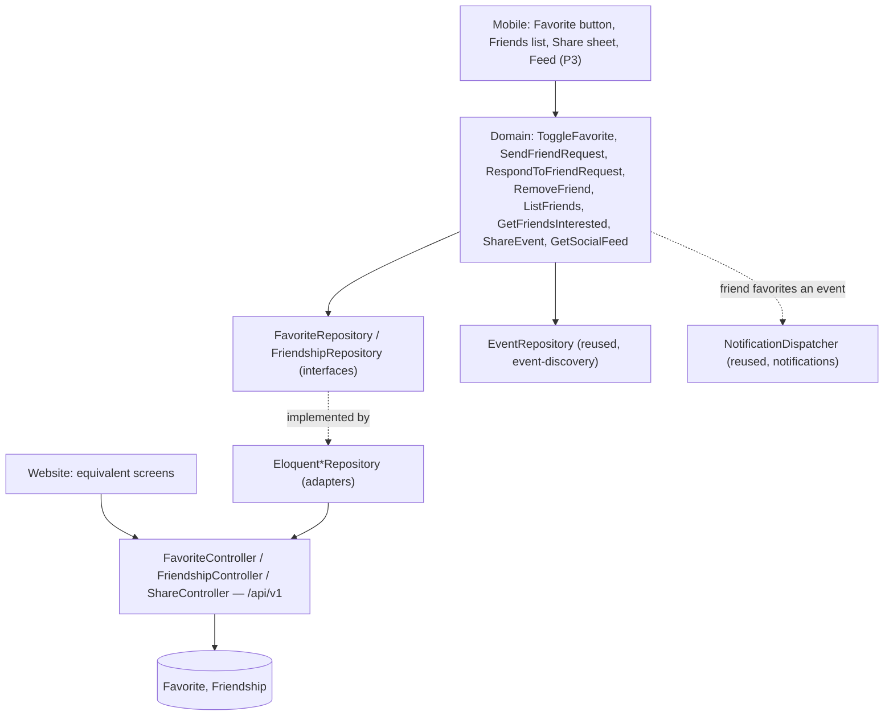

# Favorites & Social Design

**Spec**: `.specs/features/favorites-social/spec.md`
**Architecture**: `.specs/project/ARCHITECTURE.md` §4 (`Favorite`/`Friendship` data models), §2 (auth), §6.1 (feeds `NotificationDispatcher` for the friend-interest trigger), §14 (constants/enums) — referenced, not repeated here.
**Status**: Draft

---

## Architecture Overview

Fan-facing, authenticated surface under `/api/v1`, same Sanctum fan guard as `auth-fan-profile`.

**Feed ranking** (P3, FAV-24–FAV-26): reverse-chronological, per the spec's stated decision (not formally re-litigated in this Design pass — the spec already commits to it pending stakeholder sign-off, which this pass doesn't have authority to grant; flagged as inherited, not newly resolved).

---

## Code Reuse Analysis

### Existing Components to Leverage

| Component | Location | How to Use |
|---|---|---|
| `Event` entity, `EventRepository` | `event-discovery/design.md` | Read-only reference for favorite targets and feed items — not redefined here |
| `User` entity, fan Sanctum guard | `auth-fan-profile/design.md` | All endpoints here require the same fan auth as profile/auth endpoints |
| Clean Architecture layering pattern | `event-discovery/design.md`, `auth-fan-profile/design.md` | Same domain/adapter/UI split, third feature to follow it |

### Integration Points

| System | Integration Method |
|---|---|
| `NotificationDispatcher` (ARCHITECTURE.md §6.1) | `SendFriendRequest`'s accept path and `ToggleFavorite` (when a mutual friend favorites an event) call `dispatch(userId, 'friend_interest', eventId)` — this feature doesn't send notifications itself, it triggers the shared dispatcher |
| Event Discovery's public list | A favorited event that later becomes non-`Published` is filtered out of favorites/feed reads at query time (FAV-04), not via a sync job — `ToggleFavorite`'s read path joins against current `Event.status` |

---

## Components

### `Favorite` / `Friendship` (domain entities)
- **Purpose**: Per ARCHITECTURE.md §4.
- **Location**: `src/Domain/Social/Favorite.php`, `src/Domain/Social/Friendship.php`

### `ToggleFavorite` (domain use case)
- **Purpose**: FAV-01–FAV-04 — idempotent favorite/unfavorite, profile favorites list (filtered to currently-`Published` events).
- **Location**: `src/Domain/Social/UseCase/ToggleFavorite.php`
- **Interfaces**: `execute(userId, eventId): FavoriteState`, `listForUser(userId, cursor): FavoritePage`
- **Dependencies**: `FavoriteRepository`, `EventRepository` (status check), `NotificationDispatcher` (fires `friend_interest` to the favoriter's mutual friends)

### `SendFriendRequest` (domain use case)
- **Purpose**: FAV-05–FAV-08 — create `Pending`, block duplicate outgoing, auto-accept on mutual, reject if already friends.
- **Location**: `src/Domain/Social/UseCase/SendFriendRequest.php`
- **Interfaces**: `execute(requesterId, recipientId): Friendship`
- **Dependencies**: `FriendshipRepository`

### `RespondToFriendRequest` (domain use case)
- **Purpose**: FAV-09–FAV-11 — accept/reject incoming, incoming-only pending list.
- **Location**: `src/Domain/Social/UseCase/RespondToFriendRequest.php`
- **Interfaces**: `accept(requestId, respondingUserId): Friendship`, `reject(requestId, respondingUserId): void`, `listIncoming(userId): Friendship[]`
- **Dependencies**: `FriendshipRepository`

### `RemoveFriend` (domain use case)
- **Purpose**: FAV-12–FAV-14 — deletes the mutual friendship row entirely (both sides), requires a fresh request cycle to reconnect.
- **Location**: `src/Domain/Social/UseCase/RemoveFriend.php`
- **Interfaces**: `execute(userId, friendUserId): void`
- **Dependencies**: `FriendshipRepository`

### `ListFriends` (domain use case)
- **Purpose**: FAV-15–FAV-17 — accepted-only, paginated, empty-state-safe.
- **Location**: `src/Domain/Social/UseCase/ListFriends.php`
- **Interfaces**: `execute(userId, cursor): FriendPage`
- **Dependencies**: `FriendshipRepository`

### `GetFriendsInterested` (domain use case, P2)
- **Purpose**: FAV-18–FAV-20 — mutual friends who favorited a given event, graceful empty states.
- **Location**: `src/Domain/Social/UseCase/GetFriendsInterested.php`
- **Interfaces**: `execute(userId, eventId): User[]`
- **Dependencies**: `FriendshipRepository`, `FavoriteRepository`

### `ShareEvent` (domain use case, P2)
- **Purpose**: FAV-21–FAV-23 — native share deep link, in-app share-to-friend notification, reject share to non-friend.
- **Location**: `src/Domain/Social/UseCase/ShareEvent.php`
- **Interfaces**: `shareToFriend(sharerId, friendId, eventId): void` (native share is client-side only, no API call — device share sheet with a deep link URL the client constructs)
- **Dependencies**: `FriendshipRepository` (ownership/friendship check), `NotificationDispatcher`

### `GetSocialFeed` (domain use case, P3)
- **Purpose**: FAV-24–FAV-26 — reverse-chronological friend activity, empty state, excludes unpublished events.
- **Location**: `src/Domain/Social/UseCase/GetSocialFeed.php`
- **Interfaces**: `execute(userId, cursor): FeedPage`
- **Dependencies**: `FriendshipRepository`, `FavoriteRepository`, `EventRepository` (status filter)

### `FavoriteRepository` / `FriendshipRepository` (domain interfaces)
- **Location**: `src/Domain/Social/{Favorite,Friendship}Repository.php` (interfaces); Eloquent implementations in `src/Infrastructure/Persistence/`

### `FavoriteController` / `FriendshipController` / `ShareController` (infrastructure adapters)
- **Location**: `src/Http/Controllers/Api/V1/{Favorite,Friendship,Share}Controller.php`
- **Interfaces**:
  - `POST /api/v1/events/{id}/favorite` (toggle), `GET /api/v1/profile/favorites`
  - `POST /api/v1/friends/requests` (send), `GET /api/v1/friends/requests` (incoming), `POST /api/v1/friends/requests/{id}/accept`, `POST /api/v1/friends/requests/{id}/reject`, `DELETE /api/v1/friends/{userId}`, `GET /api/v1/friends`
  - `GET /api/v1/events/{id}/friends-interested`
  - `POST /api/v1/events/{id}/share` (in-app to friend)
  - `GET /api/v1/feed` (P3)

### Mobile/web UI components
- **Purpose**: Favorite button (on event card/details, mirrors event-discovery's UI), friends list + pending-requests screen, in-app share picker, feed screen (P3).
- **Location**: mobile Compose components, `qor-website` equivalents

---

## Data Models

Reuses `Favorite`, `Friendship` from ARCHITECTURE.md §4 exactly — no new tables beyond those. Reads (not writes) `Event`/`User` from the other two MVP Core features.

---

## Error Handling Strategy

| Error Scenario | Handling | User Impact (pt-BR) |
|---|---|---|
| Duplicate outgoing friend request | `SendFriendRequest` checks existing `Pending` row first | "Você já enviou uma solicitação para este usuário" |
| Request to someone already a friend | Rejected before creating a row | "Vocês já são amigos" |
| Reverse request while one is Pending | Auto-accepted (row's status flips to `accepted`) | Both sides see "Agora vocês são amigos" |
| Share to a removed/non-friend | `ShareEvent` checks `Friendship` status before sending | "Você não é mais amigo desta pessoa" — no crash, no silent no-op |
| Favorited event becomes non-`Published` | Filtered at read time in `ToggleFavorite.listForUser`/`GetSocialFeed`, not deleted from the table | Simply absent from the list/feed — no error state |
| Zero friends on friends-interested/feed | `GetFriendsInterested`/`GetSocialFeed` return an explicit empty result, not a 404/500 | Empty-state UI, not an error banner |

No client-side-validated form fields in this feature beyond friend-target selection (a picker, not free text) — favoriting/friending are single-tap actions, not forms.

---

## Analytics — GA4 Events

Per ARCHITECTURE.md §11/§14.4 (each event below is a named constant in the `AnalyticsEvents` registry, never a literal at the call site). Seed list — implementation gated on tracking-spreadsheet approval:

| Event | Fired when |
|---|---|
| `click:evento-card:favoritar` | Fan taps favorite on a card |
| `click:evento-detalhes:favoritar` | Fan taps favorite on the details page |
| `submit:amigos:enviar-solicitacao` | Fan sends a friend request |
| `click:amigos:aceitar-solicitacao` | Fan accepts an incoming request |
| `click:amigos:remover-amigo` | Fan removes a friend |
| `click:evento-detalhes:compartilhar-amigo` | Fan shares an event in-app to a friend |
| `view:feed:abrir` | Fan opens the social feed (P3) |

---

## Tech Decisions (non-obvious only)

| Decision | Choice | Rationale |
|---|---|---|
| Friendship storage | One row per pair, order-normalized (`LEAST`/`GREATEST`) | Per ARCHITECTURE.md §4 — avoids a second row on reverse requests, makes the unique constraint enforce "already friends" cheaply |
| Non-published-event filtering | Query-time filter, not a cleanup job | Simpler, always-correct — no risk of a stale favorites/feed row surviving between cleanup runs |
| Native share | Client-side only, no API call | The device share sheet + deep link needs no server round-trip; only in-app share-to-friend needs the API (to deliver a notification) |
| `Friendship.status`/pagination page size | `FriendshipStatus` backed enum + `qor.pagination.*` config (ARCHITECTURE.md §14) | `ListFriends`/`RespondToFriendRequest` never compare against `'pending'`/`'accepted'` string literals or an inlined page-size number |

---

## Requirement Coverage

FAV-01–FAV-17 (P1) map to `ToggleFavorite`, `SendFriendRequest`, `RespondToFriendRequest`, `RemoveFriend`, `ListFriends`. FAV-18–FAV-23 (P2) map to `GetFriendsInterested`, `ShareEvent`. FAV-24–FAV-26 (P3) map to `GetSocialFeed`.
