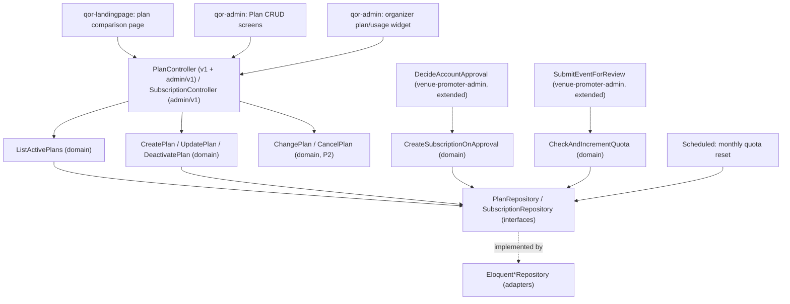

# Monetization (Publishing Plans & Landing Page) Design

**Spec**: `.specs/features/monetization/spec.md`
**Architecture**: `.specs/project/ARCHITECTURE.md` §4 (`Plan`/`Subscription`), §6.2 (quota/subscription integration points), §2/§3 (auth, API split), §14 (constants/enums — notably the default free-plan quota) — referenced, not repeated here.
**Status**: Draft

---

## Architecture Overview

Three surfaces: a public unauthenticated plans list (`/api/v1`, consumed by `qor-landingpage`), Super Admin plan CRUD (`/api/admin/v1`), and an organizer plan/usage view (`/api/admin/v1`, same guard as `venue-promoter-admin`). The enforcement mechanism lives *inside* two of `venue-promoter-admin/design.md`'s existing use cases — this feature extends them rather than adding a parallel gate.

---

## Code Reuse Analysis

### Existing Components to Leverage

| Component | Location | How to Use |
|---|---|---|
| `DecideAccountApproval` | `venue-promoter-admin/design.md` | Extended (not duplicated) to call `CreateSubscriptionOnApproval` on an `approved` outcome — this design documents the extension point, the original use case's file is what actually gains the call |
| `SubmitEventForReview` | `venue-promoter-admin/design.md` | Extended to call `CheckAndIncrementQuota` before the `Draft → Pending Review` transition — same pattern |
| Admin Sanctum guard, `/api/admin/v1` routing | ARCHITECTURE.md §2/§3 | Plan CRUD and organizer usage view reuse the guard already established, no new auth mechanism |
| Consent-capture / registration flow | `venue-promoter-admin/design.md` | Unaffected — this feature only adds what happens *after* approval, not to registration itself |

### Integration Points

| System | Integration Method |
|---|---|
| `venue-promoter-admin`'s `DecideAccountApproval` | Gains a post-approval hook: `CreateSubscriptionOnApproval(subscribableType, subscribableId)` |
| `venue-promoter-admin`'s `SubmitEventForReview` | Gains a pre-transition check: `CheckAndIncrementQuota(subscribableType, subscribableId)`, which throws a quota-exceeded domain exception the controller maps to the upgrade-prompt response |
| `qor-landingpage` | Consumes `GET /api/v1/plans` (public, no auth) to render the comparison table |

---

## Components

### `Plan` / `Subscription` (domain entities)
- **Purpose**: Per ARCHITECTURE.md §4.
- **Location**: `src/Domain/Billing/Plan.php`, `src/Domain/Billing/Subscription.php`

### `ListActivePlans` (domain use case)
- **Purpose**: MON-01–MON-03 — active plans only, immediately excludes a just-deactivated plan without affecting existing subscribers.
- **Location**: `src/Domain/Billing/UseCase/ListActivePlans.php`
- **Interfaces**: `execute(): Plan[]`
- **Dependencies**: `PlanRepository`

### `CreateSubscriptionOnApproval` (domain use case)
- **Purpose**: MON-04–MON-06 — creates a `Subscription` on the `is_default_free` plan when an account is approved; blocks approval with a configuration error if no plan is flagged default.
- **Location**: `src/Domain/Billing/UseCase/CreateSubscriptionOnApproval.php`
- **Interfaces**: `execute(subscribableType, subscribableId): Subscription`
- **Dependencies**: `PlanRepository`, `SubscriptionRepository`
- **Called by**: `DecideAccountApproval` (venue-promoter-admin), on `approved` outcome only

### `CheckAndIncrementQuota` (domain use case)
- **Purpose**: MON-07–MON-10 — the actual monetization lever: under-quota increments and proceeds, at-quota blocks with no increment, unlimited (`publish_quota IS NULL`) never blocks, approval/rejection outcomes never adjust the count.
- **Location**: `src/Domain/Billing/UseCase/CheckAndIncrementQuota.php`
- **Interfaces**: `execute(subscribableType, subscribableId): void` (throws `QuotaExceededException` on block)
- **Dependencies**: `SubscriptionRepository`
- **Called by**: `SubmitEventForReview` (venue-promoter-admin), before the `Draft → Pending Review` transition — **not** called from `DecideEventApproval`, per MON-09

### `ResetPeriodUsage` (domain use case, scheduled)
- **Purpose**: MON-11–MON-12 — resets every `Subscription.publishes_used_this_period` to 0 at each calendar-month boundary, independent of signup date or billing cycle (also satisfies MON-26).
- **Location**: `src/Domain/Billing/UseCase/ResetPeriodUsage.php`
- **Interfaces**: `execute(): void`
- **Dependencies**: `SubscriptionRepository`

### `CreatePlan` / `UpdatePlan` / `DeactivatePlan` (domain use cases)
- **Purpose**: MON-13–MON-16 — Super Admin CRUD; edits never alter historical usage counts of existing subscribers; deactivation only hides from new signups.
- **Location**: `src/Domain/Billing/UseCase/{Create,Update,Deactivate}Plan.php`
- **Dependencies**: `PlanRepository`

### `GetOrganizerUsage` (domain use case)
- **Purpose**: MON-17–MON-18 — current plan, price, quota, "X of Y used this period," at-limit flag.
- **Location**: `src/Domain/Billing/UseCase/GetOrganizerUsage.php`
- **Interfaces**: `execute(subscribableType, subscribableId): UsageSummary`
- **Dependencies**: `SubscriptionRepository`

### `ChangePlan` / `CancelPlan` (domain use cases, P2)
- **Purpose**: MON-19–MON-23 — plan switch effective at next reset (never retroactive), cancellation reverts to free at period end, published events always stay live through either.
- **Location**: `src/Domain/Billing/UseCase/{ChangePlan,CancelPlan}.php`
- **Dependencies**: `SubscriptionRepository`, `PlanRepository`

### `PlanRepository` / `SubscriptionRepository` (domain interfaces)
- **Location**: `src/Domain/Billing/{Plan,Subscription}Repository.php` (interfaces); Eloquent implementations in `src/Infrastructure/Persistence/`

### `PlanController` / `SubscriptionController` (infrastructure adapters)
- **Location**: `src/Http/Controllers/Api/V1/PlanController.php` (public list), `src/Http/Controllers/Api/AdminV1/{Plan,Subscription}Controller.php` (CRUD + organizer view)
- **Interfaces**:
  - `GET /api/v1/plans` (public — landing page)
  - `GET/POST/PATCH /api/admin/v1/plans`, `POST /api/admin/v1/plans/{id}/deactivate` (Super Admin only, enforced by `PlanPolicy`)
  - `GET /api/admin/v1/subscription` (organizer's own usage), `POST /api/admin/v1/subscription/change-plan`, `POST /api/admin/v1/subscription/cancel` (P2)

### UI components
- **Purpose**: `qor-landingpage` plan comparison table + CTA into self-registration (reuses `venue-promoter-admin`'s registration flow unmodified); `qor-admin` Plan CRUD screens; organizer usage widget (progress bar + at-limit banner) surfaced in the admin panel's event-submission flow.
- **Location**: `qor-landingpage`, `qor-admin`

---

## Data Models

Reuses `Plan`, `Subscription` from ARCHITECTURE.md §4 exactly. No new tables.

---

## Error Handling Strategy

| Error Scenario | Handling | User Impact (pt-BR) |
|---|---|---|
| No plan flagged `is_default_free` at approval time | `CreateSubscriptionOnApproval` throws, `DecideAccountApproval` blocks the approval | Super Admin sees "Configure um plano gratuito padrão antes de aprovar contas" — not a silent approval with no subscription |
| Organizer at quota attempts submission | `CheckAndIncrementQuota` throws `QuotaExceededException`, no increment | "Você atingiu o limite de publicações do seu plano" + upgrade-prompt link to the landing page |
| Plan CRUD missing required field | Field-specific validation error | e.g. "O preço mensal é obrigatório" |
| Concurrent Super Admin edits to the same plan | Last-write-wins (spec's stated assumption — no optimistic locking) | No user-facing error; flagged as a known limitation, not addressed by this design |
| Downgrade while already over the new quota | Not retroactively blocked — new quota applies at next reset only | Organizer sees no immediate change; usage view reflects the new quota starting next period |

Client-side validation before submit: Plan CRUD form validates required fields (name, monthly price, quota) and numeric ranges (non-negative price/quota) before submit, mirroring the API's Form Request rules, pt-BR.

---

## Analytics — GA4 Events

Per ARCHITECTURE.md §11/§14.4 (each event below is a named constant in the `AnalyticsEvents` registry, never a literal at the call site). Seed list — implementation gated on tracking-spreadsheet approval:

| Event | Fired when |
|---|---|
| `view:planos:pagina-inicial` | Visitor opens the landing page |
| `click:planos:iniciar-gratis` | Visitor clicks the free-plan CTA into registration |
| `click:planos:fazer-upgrade` | Organizer clicks an upgrade prompt (from a quota block or the usage view) |
| `submit:admin-planos:criar-plano` | Super Admin creates a plan |
| `submit:admin-planos:editar-plano` | Super Admin edits a plan |
| `click:assinatura:trocar-plano` | Organizer changes plans (P2) |

---

## Tech Decisions (non-obvious only)

| Decision | Choice | Rationale |
|---|---|---|
| Quota enforcement location | Inside `SubmitEventForReview`, not a separate middleware/gate | Reuses the existing submission use case's single entry point rather than duplicating the Draft→PendingReview transition logic in two places |
| Subscription creation timing | On account *approval*, not on registration | An unapproved account can't publish anyway (ADMIN-20) — a `Subscription` before approval would be inert state with no purpose |
| Default-plan enforcement | Hard block on approval if no default flagged, not a silent fallback | Per MON-05 — surfaces the misconfiguration to the Super Admin immediately rather than letting an account through with no billing relationship |
| Concurrent-edit handling | Last-write-wins, no locking | Spec's stated assumption (§171-179 of the spec) — no optimistic-locking pattern exists elsewhere in this codebase to extend, and plan edits are low-frequency/single-operator in practice |
| Free-plan quota value (5), `SubscribableType`/`SubscriptionStatus`/`BillingCycle` | Config key (`qor.billing.default_free_quota`) read once by the seeder + backed enums (ARCHITECTURE.md §14) | The `5` from PRD §5.8 is not hardcoded in `CreateSubscriptionOnApproval` or `CheckAndIncrementQuota` — both read the seeded `Plan.publish_quota` row, which Super Admin can change without touching either use case |

---

## Requirement Coverage

MON-01–MON-18 (P1) map to `ListActivePlans`, `CreateSubscriptionOnApproval`, `CheckAndIncrementQuota`, `ResetPeriodUsage`, `CreatePlan`/`UpdatePlan`/`DeactivatePlan`, `GetOrganizerUsage`. MON-19–MON-26 (P2) map to `ChangePlan`/`CancelPlan` and the annual-billing-cycle field already modeled on `Plan`/`Subscription` in ARCHITECTURE.md §4.
