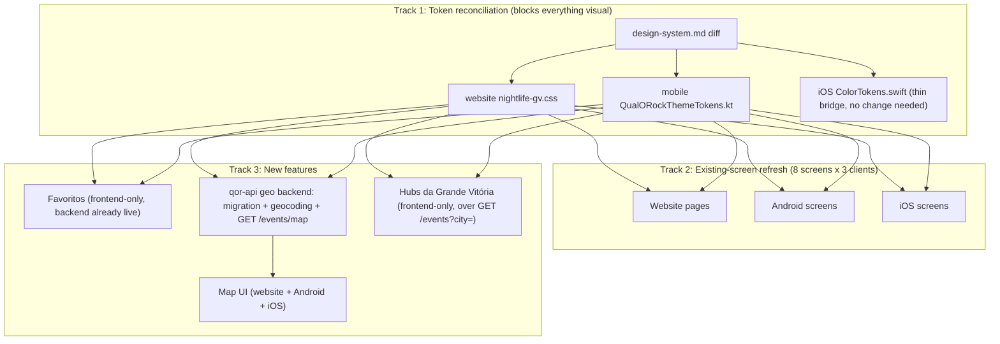
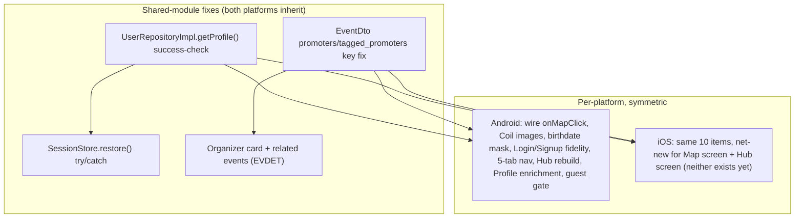

# Nightlife GV Stitch Refresh Design

**Spec**: `.specs/features/nightlife-gv-stitch-refresh/spec.md`
**Status**: Approved

---

## Architecture Overview

Three independent tracks, one shared dependency edge:



Track 1 must land first (every visual task consumes reconciled tokens). Within Track 3, G1 (backend) must merge before G2 (client Map UI) per `ARCHITECTURE.md` §8.11's sequencing rule — this is the one hard cross-repo dependency in the whole feature. Favoritos and Hubs have no such dependency and can proceed in parallel with the screen refresh once tokens are settled.

---

## Approach Exploration: Mapa Interativo geo backend

Three viable approaches were considered:

| Approach | Trade-off |
| --- | --- |
| **A — Plain `latitude`/`longitude` decimal columns + bounding-box `WHERE` query, btree composite index** (chosen) | No new Postgres extension; simple to test/reason about; fits the project's actual scale (4 fixed cities, regional platform) |
| B — PostGIS extension, geography column, `ST_DWithin` | More powerful (true radius/polygon queries) but a new extension with its own ops/migration/backup story, no precedent anywhere in this codebase, solves a scale problem this project doesn't have |
| C — Geocode on-the-fly per map request, no persistence | Avoids a migration but re-geocodes on every map view (latency + Google API cost/rate-limit risk on a frequently-viewed screen); also directly contradicts spec AC MAPGEO-01/04 (coordinates persist on the event) |

**User confirmed Approach A.** Bounding-box query shape: `WHERE latitude BETWEEN :south AND :north AND longitude BETWEEN :west AND :east`, backed by a plain composite btree index on `(latitude, longitude)`. A per-city convenience mode (no explicit box — resolve to a fixed lat/lng radius per `City` enum value) is offered alongside the box params, since the client's Hub/Map entry points will often just want "this city's events," not a client-computed viewport box.

---

## Code Reuse Analysis

### Existing Components to Leverage

| Component | Location | How to Use |
| --- | --- | --- |
| `Event` domain entity + `EventRepository` port | `api/src/Domain/Event/Event.php`, `EventRepository.php` | Extend entity with nullable `latitude`/`longitude`; add a new repository method for the bounding-box query, following the existing eager-load-genre pattern from AD-023 |
| `EventController::index` city-filter pattern | `api/src/Http/Controllers/Api/V1/EventController.php` | New `GET /events/map` controller reuses the same public-event query base, request validation style, and JSON envelope |
| `NotificationSender` interface pattern (domain port, infra adapter) | `ARCHITECTURE.md` §6.1 | Mirror this shape for a new `GeocodingPort` interface + `GoogleGeocodingAdapter` — domain never imports the Google SDK directly, same Clean Architecture discipline already established for FCM/SES |
| `FavoriteController` / `POST /events/{id}/favorite`, `GET /favorites` | `api/routes/api_v1.php` (already routed) | No backend change — website/mobile clients call these directly |
| `GoogleMap.tsx` (website) | `website/components/design-system/GoogleMap.tsx` | Extend from single-pin (event detail) to multi-pin (Map screen) rather than building a second map component |
| `EventMapState.kt` / `EventMapState.swift` | `mobile/androidApp/.../ui/screen/EventMapState.kt`, `mobile/iosApp/.../UI/Screens/EventMapState.swift` | Extend the existing single-event geocoded-point pattern to a multi-event list; same Google Maps SDK already integrated |
| `CityGrid` / `CityFilterBar` (website), `BottomNavDestination` enum (mobile) | `website/components/design-system/`, `mobile/{androidApp,iosApp}/.../BottomNav.*` | Reuse for Hub entry points and to enable the existing disabled `Favoritos` tab |
| `EventCard` component (all 3 clients) | website `components/design-system/EventCard.tsx`, Android/iOS equivalents | Reuse as-is for Favoritos list and Hub list rendering — no new card component |
| `EmptyState` / `PlaceholderImage` | all 3 clients | Reuse for empty Favoritos list, empty Hub, and map-with-no-pins states |
| `ResetPassword` use case + `verifyPasswordResetCode`/`/auth/password/verify-code` endpoint | `mobile/shared/.../ResetPassword.kt`, `qor-api` (already implemented, AD-016) | New shared-module use case (`VerifyPasswordResetCode`) calls the existing endpoint; no new backend work |
| `VerifyEmail`/OTP UI pattern (`OtpCodeInput` website, mobile's existing OTP entry in `EmailVerificationScreen`) | website `components/design-system/OtpCodeInput.tsx`, mobile `EmailVerificationScreen.kt`/`View.swift` | Reuse the same OTP-entry component/pattern for the new password-recovery verify-code step, rather than building a second OTP input |

### Integration Points

| System | Integration Method |
| --- | --- |
| Google Maps/Geocoding API | New `GoogleGeocodingAdapter` (backend, server-side geocoding calls) + existing client-side Google Maps SDK usage (already integrated in `GoogleMap.tsx` and both mobile `EventMapState` files) — same vendor, two different API surfaces (Geocoding API server-side, Maps SDK client-side) |
| `qor-api` public event list | `GET /events/map` sits alongside the existing `GET /events` as a new, additive endpoint — no change to the existing endpoint's contract |
| `mobile/shared` domain layer | New `FavoriteRepository`/`ToggleFavorite`/`ListFavorites` use cases, `MapEventRepository`/`GetMapEvents` use case, `VerifyPasswordResetCode` use case — all follow the existing `EventRepository`/`UserRepository` port+impl+use-case shape already in `shared/src/commonMain/kotlin/domain/` |

---

## Components

### `GeocodingPort` (domain interface) + `GoogleGeocodingAdapter` (infra)

- **Purpose**: Resolve a free-text address to lat/lng, without the domain layer depending on Google's SDK.
- **Location**: `api/src/Domain/Event/GeocodingPort.php` (interface); `api/src/Infrastructure/Geocoding/GoogleGeocodingAdapter.php` (implementation).
- **Interfaces**:
  - `geocode(string $address): ?Coordinates` — returns `null` on failure (not an exception) so callers implement the "save without coordinates, log the failure" behavior from MAPGEO-02 without a try/catch at every call site.
- **Dependencies**: Google Geocoding API key (server-side only, per `ARCHITECTURE.md` §13.3 secrets management — never shipped in client bundles).
- **Reuses**: Same domain-port/infra-adapter shape as `NotificationSender`/`FcmPushSender`/`SesEmailSender` (§6.1).

### `Event` entity extension

- **Purpose**: Carry optional coordinates alongside the existing free-text `address`.
- **Location**: `api/src/Domain/Event/Event.php` (add `?float $latitude`, `?float $longitude`); migration adds nullable `latitude`/`longitude` decimal columns to `events`.
- **Dependencies**: None new — purely additive fields.
- **Reuses**: Existing `Event` construction/validation pattern; follows the same "resolve at construction/save time" discipline AD-023 established for `genreName`.

### `GET /events/map` (new controller action)

- **Purpose**: Return geocoded events within a bounding box or a named city.
- **Location**: `api/src/Http/Controllers/Api/V1/EventController.php` (new `mapEvents` action) or a new `MapController` if the existing controller is already large — decided during Tasks based on actual file size.
- **Interfaces**: `GET /api/v1/events/map?north=&south=&east=&west=` OR `GET /api/v1/events/map?city=<City enum value>` (city resolves to a fixed lat/lng radius server-side — exact radius value lives in `config/qor.php`, no magic number, per §14.2's convention).
- **Dependencies**: `EventRepository`'s new bounding-box query method.
- **Reuses**: Same public/no-auth access pattern as `GET /events` (map browsing doesn't require login, matching the rest of public event discovery).

### `mobile/shared` — Favorites domain slice

- **Purpose**: Toggle/list favorites from both Android and iOS through one shared use case.
- **Location**: `mobile/shared/src/commonMain/kotlin/domain/favorite/` — `Favorite.kt`, `FavoriteRepository.kt` (interface), `usecase/ToggleFavorite.kt`, `usecase/ListFavorites.kt`; impl in `mobile/shared/src/commonMain/kotlin/data/FavoriteRepositoryImpl.kt`.
- **Interfaces**:
  - `ToggleFavorite(eventId: Long): Result<Boolean>` — calls `POST /events/{id}/favorite`, returns the new favorited state.
  - `ListFavorites(): Result<List<Event>>` — calls `GET /favorites`.
- **Reuses**: Same repository-port/impl/use-case shape as `EventRepository`/`EventRepositoryImpl`; same `AuthenticatedHttpClient` already used for authenticated calls.

### `mobile/shared` — Password-recovery verify-code use case

- **Purpose**: Add the missing intermediate step so mobile matches the website's 3-step flow.
- **Location**: `mobile/shared/src/commonMain/kotlin/domain/user/usecase/VerifyPasswordResetCode.kt`.
- **Interfaces**: `VerifyPasswordResetCode(email: String, code: String): Result<Unit>` — calls `qor-api`'s existing `/auth/password/verify-code`.
- **Dependencies**: `UserRepository` gains one new method (`verifyPasswordResetCode`), mirroring the existing `resendVerification`/`verifyEmailCode` pair added for S12b (AD-021).
- **Reuses**: Same OTP-code pattern already built for email verification — `sanitizeOtpInput` and the OTP-entry Compose/SwiftUI components are reused, not rebuilt.

### `mobile/shared` — Map domain slice

- **Purpose**: Fetch geocoded events for the Map screen.
- **Location**: `mobile/shared/src/commonMain/kotlin/domain/event/usecase/GetMapEvents.kt`; extends `EventRepository` with a `getMapEvents(bounds or city)` method.
- **Interfaces**: `GetMapEvents(city: City? = null, bounds: MapBounds? = null): Result<List<Event>>`.
- **Reuses**: Existing `Event` DTO/entity (now carrying optional lat/lng), existing `EventRepositoryImpl` HTTP-call pattern.

### Website — new routes

- **`/favoritos`** (`website/app/favoritos/page.tsx`): reuses `EventCard`, adds `getFavorites`/`toggleFavorite` to `lib/api/client.ts`, gated by the existing `PUBLIC_PATHS` auth pattern (closing the TODO already in `lib/api/http.ts`).
- **`/mapa`** (`website/app/mapa/page.tsx`): extends `GoogleMap.tsx` to multi-pin mode, adds `getMapEvents` to `lib/api/client.ts`.
- **Hub route(s)** (exact URL shape decided in Tasks — candidate: `/hubs/[city]`): reuses `CityGrid`/`CityFilterBar` styling, calls the existing `listEvents({ city })`.

### Android/iOS — new screens

- **`FavoritesScreen.kt` / `FavoritesView.swift`**: wired into the existing disabled `BottomNavDestination.Favoritos`/`.favoritos` tab (replacing the stub/`EmptyView()`), reusing the existing event-card Composable/SwiftUI view.
- **`MapScreen.kt` / `MapView.swift`**: new nav-graph route (`map` on Android, a new case in `AppNavigation.swift`'s authenticated stack on iOS), extending the `EventMapState` pattern to multiple pins.
- **`HubScreen.kt` / `HubView.swift`** (or per-city variants — exact shape decided in Tasks): new nav-graph route(s), reusing `EventCard`.
- **`PasswordRecoveryScreen.kt` / `PasswordRecoveryView.swift`**: restructured into 3 real steps (currently 2), consuming the new `VerifyPasswordResetCode` use case for the middle step.

---

## Data Models

### `Event` (extended)

```
id, ..., address (existing, unchanged),
latitude (nullable, decimal(10,7)),   // new
longitude (nullable, decimal(10,7)),  // new
...
```

**Relationships**: unchanged — this is a pure field addition, no new FK.

### `MapBounds` (backend request DTO / shared-module value type, not persisted)

```typescript
interface MapBounds {
  north: number
  south: number
  east: number
  west: number
}
```

Used only as a request-shape value object on both the `qor-api` controller (Form Request validation) and `mobile/shared`'s `GetMapEvents` use case parameter — not a database entity.

---

## Error Handling Strategy

| Error Scenario | Handling | User Impact |
| --- | --- | --- |
| Geocoding fails (address unresolvable, API error/timeout) | `GeocodingPort::geocode()` returns `null`; event saves with `latitude`/`longitude` left `null`; failure logged server-side (existing logging convention) | None visible at save time — the event just doesn't appear on the map until re-geocoded |
| `GET /events/map` called with an invalid/missing bounding box and no `city` | Form Request validation rejects with the existing 422 envelope (`ARCHITECTURE.md` §3) | pt-BR validation message, same shape as every other endpoint |
| Favorite toggle fails (network, 401 for an expired session) | Optimistic UI update rolls back to server-confirmed state on error | Toast/inline error, favorite state visually reverts |
| Map screen has zero geocoded events in view | Empty map (no pins), no error — this is a valid state, not a failure | Existing `EmptyState` pattern if the client wants an overlay hint, otherwise just an empty map |
| Password-recovery verify-code entered wrong/expired | `VerifyPasswordResetCode` returns a `Result` failure; screen shows pt-BR error, allows retry/resend, does not advance | Stays on the code-entry step |

---

## Risks & Concerns

| Concern | Location (file:line) | Impact | Mitigation |
| --- | --- | --- | --- |
| `nightlife-gv.css`'s `@theme` token block is currently unconsumed — every website component uses raw Tailwind arbitrary-hex classes instead of the generated `bg-nightlife-*`/`text-nightlife-*` utilities (flagged in `STATE.md` Todos, tied to AD-015) | `website/styles/nightlife-gv.css` | Not a defect this feature introduces, but every new/touched component in this pass (existing-screen refresh + 3 new features) is an opportunity to either perpetuate the raw-hex pattern or finally consume the theme utilities | Out of scope for this pass's token-reconciliation story (which is about *values*, not *consumption mechanism*) — stays a documented Todo. New components should follow whatever the majority pattern is at time of writing to avoid a half-migrated inconsistency mid-feature. |
| Geocoding a real address to lat/lng depends on an external Google API call inside (or triggered by) the event create/update request path | `api/src/Domain/Event/*` (new) | If synchronous, a slow/failed geocoding call could add latency or (if mis-implemented) block event save entirely | Design mandates non-blocking failure (AC MAPGEO-02: save proceeds, coordinates null, failure logged) — never let geocoding failure block the write. Whether the call itself is synchronous-but-fire-and-forget-on-failure or queued is a Tasks-phase implementation detail, not a design gate. |
| `mobile`'s `PasswordRecoveryScreen`/`View` restructuring from 2→3 steps touches an already-shipped, tested screen (A10/AD-021) | `mobile/androidApp/.../PasswordRecoveryScreen.kt`, `mobile/iosApp/.../PasswordRecoveryView.swift` | Regression risk on an existing, working flow | Existing tests for the 2-step flow must be replaced (not just extended) with tests for the real 3-step flow per TDD's RED→GREEN→REFACTOR — this is treated as a real behavior change, not additive |
| The new `GET /events/map` endpoint is public/no-auth (matching `GET /events`) but returns precise coordinates, which is more granular location data than the existing city-only public list | `api/src/Http/Controllers/Api/V1/EventController.php` (new action) | Low — event locations are already semi-public (venue names/addresses are shown on Event Detail today), so this isn't new PII exposure, just a new query shape over already-public data | No mitigation needed beyond what's already true of the existing public Event Detail address display; noted here so it isn't mistaken for an oversight |

---

## Tech Decisions (only non-obvious ones)

| Decision | Choice | Rationale |
| --- | --- | --- |
| Geo storage/query shape | Plain nullable `latitude`/`longitude` columns + bounding-box `WHERE` + composite btree index | User-confirmed (Approach Exploration above) — matches project scale, no new Postgres extension |
| Geocoding integration shape | New `GeocodingPort` domain interface + `GoogleGeocodingAdapter` infra implementation | Mirrors the existing `NotificationSender`/FCM/SES pattern (§6.1) — keeps the domain layer framework/vendor-free per Clean Architecture (§8.5) |
| Password-recovery fix scope | Real 3-step parity (new shared-module `VerifyPasswordResetCode` use case), not a re-skin of the 2-step flow | User-confirmed in Discuss |
| Hubs vs. Explore | Hubs is additive, `/eventos` untouched | User-confirmed in Discuss |
| City-radius default for map "city mode" queries | A config-driven radius per `City` enum value in `config/qor.php` (exact km value decided in Tasks) | Follows §14.2's "every numeric threshold in config, never inlined" convention |

> **Project-level decision to record in STATE.md after implementation:** the `GeocodingPort`/adapter pattern for Google Geocoding API integration becomes the project's reference shape for any future external-API integration needing the same domain/infra split — worth its own `AD-###` entry alongside the feature's completion entry.

## T1 Token Audit — Delta List

Diffed `design-system.md`, `website/styles/nightlife-gv.css`, `mobile/shared/.../QualORockThemeTokens.kt`, and `mobile/iosApp/.../ColorTokens.swift` line-by-line against the "Nightlife Discovery" Stitch design system's `designMd` (fetched live via `mcp__stitch__list_design_systems`, project `6008587636717635180`).

**Result: zero real deltas.**

- **Colors**: every surface/text/accent hex in all four files matches Stitch's `designMd` exactly — `bg-deep #0B0D14`, `bg-base #12141D`, `surface-card #1B1E29`, `surface-card-hover #232733`, `border-subtle #2A2E3B`, `text-primary #F5F6FA`, `text-secondary #9A9FB0`, `text-tertiary #666B7D`, `accent-pink #FF2E7E`, `accent-orange #FF8A1E`, `accent-purple #B14EFF`, `accent-blue #2EC5FF`, `danger #FF4D4D`.
- **Typography**: nearest size+weight mapping (per the spec's agreed mapping rule) lines up with Stitch's scale for every existing role — `text-event-title` (22px/700) ↔ `headline-md`, `text-event-title-lg` (32px/700) ↔ `headline-lg`, `text-venue-name` (15px/600) ↔ `label-venue`, `text-city-label` (12px/600/uppercase) ↔ `label-caps`, `text-metadata` (13px/500) ↔ `body-sm`, `text-badge` (11px/600/uppercase) ↔ `badge-tag`, `text-body` (14px/400) ↔ `body-md`, `text-button` (14px/600) ↔ `label-btn`. Stitch has four roles with no current mapping (`display-hero`, `display-hero-mobile`, `headline-sm`, `title-card`) — per context.md, left undefined; added only if a later screen-refresh task's structural diff needs one.
- **Spacing**: `4/8/16/24/32/48/64px` (space-1..7) matches Stitch's `space-xxs..space-3xl` exactly.
- **Radius**: `md` (12px) and `lg` (16px) match Stitch's `md`/`lg`. `sm` stays at 6px vs. Stitch's 4px — logged assumption in spec.md/context.md, agent judgment call, not changed here.

No file edits were required — all four surfaces were already reconciled before this task ran.

---

## Addendum: Stitch Fidelity Audit fixes (2026-09-10)

**Covers**: `BUGFIX-01..12`, `REFRESH-05..08`, `NAV-01..04`, `HUB-05..06`, `EVDET-01..04`, `PROF-01..05`, `GUEST-01..04` — the 34 requirement IDs spec.md's addendum added after a side-by-side audit of the already-shipped T1–T40 work found unmet ACs, four concrete regressions, and confirmed scope for previously-deferred content plus guest browsing. `qor-website` is not in scope for this addendum (audit was mobile-only).

### Architecture Overview

This is fix-and-extend work over the existing T1–T40 architecture, not a new track. Every item below touches `mobile/androidApp`, `mobile/iosApp`, and/or `mobile/shared` only; no new `qor-api` endpoints are needed (the EventDetail organizer-card story uses data the API already returns — see item 8's bug finding — and the Profile preferences story uses `GET/PATCH /preferences`, which already ships). Two items are shared-module-only fixes that both platforms inherit for free (items 3 and, partially, 4); the rest require symmetric Android+iOS work per context.md's "Android + iOS parity" decision.



### Code Reuse Analysis — additions

| Component | Location | How to Use |
| --- | --- | --- |
| `InstagramCta` gradient brush | `CtaButtons.kt:83-116` (Android), `CtaButtons.swift:45-72` (iOS) | Becomes `PrimaryButton`'s background on Login/Signup (REFRESH-06) instead of a new gradient implementation |
| `MapaCta` / `InstagramCta` pill buttons | `CtaButtons.kt`/`CtaButtons.swift` | Reused as EventDetail's dual pill actions (EVDET-02) — no new button component |
| `PlaceholderImage` | Android `ui/components/PlaceholderImage.kt`, iOS `UI/Components/PlaceholderImage.swift` | Reused as the image-load fallback (BUGFIX-04..06) — already the correct null/error-state pattern, just not wired to `coverImageUrl` yet |
| `EventCard` | Android `ui/components/EventCard.kt`, iOS `UI/Components/EventCard.swift` | Reused as the related-events carousel's item view (EVDET-03) and the favorite-venues/recommendations list items (PROF-03) — no new card component |
| `register`/`login`/`verifyEmailCode`'s branch-before-decode pattern | `UserRepositoryImpl.kt:93-99,117-128,172-182` | Mirrored by the `getProfile()` fix (BUGFIX-07..09) rather than inventing a new error-handling shape |
| `website`'s `PUBLIC_PATHS`/`PUBLIC_PATH_PREFIXES` allowlist | `website/lib/api/http.ts:92-108` | Conceptual precedent for mobile's guest-access gate (GUEST-01..04) — same "allowlist checked at the boundary" shape, not the same code (mobile's boundary is nav-graph/tab-tap, not an HTTP interceptor) |
| `GET /events?city=&genre=` | `api/src/Http/Requests/Api/V1/ListEventsRequest.php:19-26` | Reused for both EVDET-03 (related events) and PROF-03 (recommendations) — one shared use case, two call sites, no new endpoint |
| `GET/PATCH /preferences` | `api/src/Http/Controllers/Api/V1/ProfileController.php` (`showPreferences`/`updatePreferences`) | Already live per `AUTH-20..24`'s backend — PROF-02 only needs a new `mobile/shared` client, no `qor-api` change |

### Components

#### Map navigation wiring (BUGFIX-01/02/03)

- **Purpose**: Make every "Ver no Mapa" control actually navigate, on both platforms.
- **Location**: Android — `QorNavGraph.kt` (`HomeFeedScreen`/`ExploreScreen` instantiation ~205-218, `HubScreen.kt:81`). iOS — `AppNavigation.swift` (new `.map` case), new `UI/Screens/MapView.swift`.
- **Interfaces**: Android threads a real `onMapClick: (Event) -> Unit = { navController.navigate(Routes.Map) }` through `HomeFeedScreen`/`ExploreScreen`/`HubScreen` (replacing the current default/hardcoded no-ops). iOS gains a `MapView(events: [Event])` (multi-pin) plus the same `onMapClick` override on `HomeFeedView`/`ExploreView`.
- **Dependencies**: Android's `Routes.Map`/`MapScreen` already exist (T31-33) — this item only wires callers. iOS has no Map screen at all — net-new.
- **Reuses**: iOS's `MapView` extends the existing `EventMapState`-style single-event geocoding pattern (`EventMapState.swift`) to a list, same Google Maps SDK integration already used elsewhere.

#### Event cover images (BUGFIX-04/05/06)

- **Purpose**: Render real event cover photos with a correct placeholder fallback.
- **Location**: Android — `EventCard.kt` (image `Box`, ~92-116), `EventDetailScreen.kt:273-275`; `androidApp/build.gradle.kts` (new Coil dependency). iOS — `EventCard.swift` (`imageHolder`, 63-90), `EventDetailView.swift:196-197`.
- **Interfaces**: Both platforms branch on `event.coverImageUrl`: non-null → load via the platform's image loader; null or load-error → `PlaceholderImage()`.
- **Dependencies**: Android needs a new Coil dependency (none exists today). iOS needs none — `AsyncImage` is native SwiftUI.
- **Reuses**: `PlaceholderImage()` composable/view on both platforms — the fallback path is unchanged, only the "try to load a real image first" branch is new.

#### Cold-launch crash fix (BUGFIX-07/08/09)

- **Purpose**: Stop `UserRepositoryImpl.getProfile()` from throwing an uncaught `MissingFieldException` on a stale/invalid session.
- **Location**: `mobile/shared/src/commonMain/kotlin/data/UserRepositoryImpl.kt:184-185` (`getProfile()`); `mobile/shared/src/commonMain/kotlin/data/SessionStore.kt:25-28` (`restore()`).
- **Interfaces**: `getProfile()` checks `response.status.isSuccess()` before decoding `UserResponseDto`, mirroring `register`/`login`/`verifyEmailCode`'s existing branch, and throws/returns a typed failure on non-success instead of a raw deserialize exception. `restore()` wraps the call in try/catch, clears the stored token, and leaves `_currentUser.value = null` on any failure.
- **Dependencies**: None new.
- **Reuses**: The exact branch-before-decode shape already used three other places in the same file.

#### Signup birthdate fix (BUGFIX-10/11/12)

- **Purpose**: Accept valid pt-BR-formatted birthdates; reject only genuinely invalid ones with a specific message.
- **Location**: Android — `SignupScreen.kt` (field, ~111-118), `SignupViewModel.kt` (`validateBirthdate`, 56-57). iOS — `SignupView.swift` (field, 82-87), `SignupViewModel.swift` (`validateBirthdate`, 64-66).
- **Interfaces**: Field gains a `DD/MM/AAAA` input mask on both platforms. `validateBirthdate` gains real parse validation (impossible date → specific pt-BR error, not just blank-check). On submit, the parsed date is converted to ISO 8601 before being passed into the existing shared `RegisterFan` use case / `RegisterRequestDto.birthdate: String` — the DTO's shape is unchanged, only what's placed into it.
- **Dependencies**: None new — parsing/masking uses each platform's existing date primitives.
- **Reuses**: The existing shared `RegisterRequestDto`/`RegisterFan` use case contract is untouched; this is purely a UI-layer input-correctness fix.

#### Login/Signup component fidelity (REFRESH-05..08)

- **Purpose**: Bring Login/Signup to real Stitch component-level match (logo badge, gradient CTA, icon-prefixed fields, eye-icon toggle).
- **Location**: Android — `LoginScreen.kt`, `SignupScreen.kt`, `CtaButtons.kt` (`PrimaryButton`, 127-163), `FormFields.kt` (`QorTextField` 30-63, `PasswordField` 97-119). iOS — `LoginView.swift`, `SignupView.swift`, `CtaButtons.swift`, `FormFields.swift` (8-48, 87-107).
- **Interfaces**: New logo-badge composable/view (net-new, no existing pattern — circular badge + wordmark) above the form on both screens, both platforms. `PrimaryButton`'s background becomes `InstagramCta`'s gradient brush. `QorTextField` gains a `leadingIcon` param (mail/lock). `PasswordField`'s trailing text-link toggle becomes an eye/eye-slash icon.
- **Dependencies**: None new.
- **Reuses**: `InstagramCta`'s gradient brush pattern (both platforms); no new button/gradient implementation.

#### Bottom nav 5-tab set (NAV-01..04)

- **Purpose**: Bottom nav reaches the Stitch mock's Início/Hubs/Mapa/Salvos/Perfil set.
- **Location**: Android — `BottomNav.kt` (`BottomNavDestination`, 40-45), `QorNavGraph.kt` (`BottomNavScaffold` routing, 352-378). iOS — `BottomNav.swift` (`BottomNavDestination`, 8-24), `AppNavigation.swift` (`MainTabRootView` switch, 184-193), `BottomNavDestinationTests.swift` (update the "favoritos is disabled" test to match its new redirect-gated behavior per item 10).
- **Interfaces**: `BottomNavDestination` gains `Hubs`/`Mapa` cases on both platforms; the destination-routing `when`/`switch` gains matching branches to the Hub city-selector landing (item 7) and the new `MapView`/`MapScreen`.
- **Dependencies**: Depends on items 1 (Map) and 7 (Hub) existing.
- **Reuses**: Existing `BottomNavDestination` enum shape and its routing pattern — additive cases, no restructuring.

#### Hub rebuild (HUB-05/06)

- **Purpose**: Hub reads as a curated, distinct destination — not a plain per-city event list.
- **Location**: Android — `HubScreen.kt` (rebuild the `Content` body, 71-84). iOS — new `UI/Screens/HubView.swift` (net-new, zero prior implementation).
- **Interfaces**: New city-selector **landing** state (4 gradient city cards + event counts) as the Hubs tab's actual entry point; drilling into a city renders the rebuilt curated per-city layout (featured/highlighted event treatment, city header imagery/badge per the Stitch mock) — the landing state doesn't exist on either platform today, and the curated per-city layout doesn't exist on either platform today either (Android's current `HubScreen` only renders the plain-list per-city state).
- **Dependencies**: Reuses `GET /events?city=` — presentation-only change, per HUB-04's existing data-contract constraint.
- **Reuses**: `EventCard` for the curated list's items; `CityGrid`/`CityFilterBar`-equivalent styling already established on website for the city-selector cards' visual treatment.

#### EventDetail content parity (EVDET-01..04)

- **Purpose**: Organizer card, dual pill actions, related-events carousel.
- **Location**: `mobile/shared/src/commonMain/kotlin/data/EventDto.kt:23-42` (key-mapping fix, prerequisite); Android `EventDetailScreen.kt` (347+ promoter section, 323-327 map action); iOS `EventDetailView.swift` (`PromoterContactRow` 336-373, `mapSection` 272-298).
- **Interfaces**: `EventDto`'s promoter mapping is corrected: API's `tagged_promoters`/`contact_phone`/`contact_email` → shared `EventPromoterContact.name/phone/email/instagram/tiktok` (was silently mapping to nothing). New organizer-card component (name, icon/initials — no logo field exists on the API response) positioned under the title block. New dual pill row (`MapaCta` + `InstagramCta`) replaces the single "Abrir no mapa" button. New horizontal carousel (`LazyRow`/`LazyHStack`, no existing horizontal-list pattern to reuse — first one in the codebase) using `EventCard`, sourced from `GET /events?city=&genre=` filtered to exclude the current event. Each section (organizer/Instagram pill/carousel) renders independently and is omitted, not shown broken, when its data is absent.
- **Dependencies**: The `EventDto` key-mapping fix must land before the organizer card can show real data — without it, the card would always render empty regardless of UI correctness.
- **Reuses**: `EventCard` (carousel items), `MapaCta`/`InstagramCta` (pill actions).

#### Profile content parity (PROF-01..05)

- **Purpose**: Stat pills, genre/radius preferences, favorite venues, recommendations, logout.
- **Location**: Android `ProfileScreen.kt` (79-163); iOS `ProfileView.swift` (168-273); new `mobile/shared` preferences client (`domain/user/usecase/GetPreferences.kt`/`UpdatePreferences.kt`, or platform-equivalent naming, calling the already-live `GET/PATCH /preferences`).
- **Interfaces**: `GetPreferences(): Result<UserPreferences>` / `UpdatePreferences(genreIds, radiusKm): Result<Unit>` — new shared use cases following the existing `EventRepository`/`UserRepository` port+impl+use-case shape. Stat pills computed from on-device favorited-events data (count, distinct cities) — no new aggregation endpoint. Favorite-venues list derives from favorited events' `address` field, deduplicated (no venue display-name field exists — see Risks). Recommendations reuse EVDET-03's same `GET /events?city=&genre=` use case. Logout control calls `SessionStore`'s existing clear path, then routes to guest-browsable Home.
- **Dependencies**: `AUTH-20..24`'s backend (`GET/PATCH /preferences`) already exists — only the shared-module client and UI are new.
- **Reuses**: `EmptyState` pattern for the zero-favorites case (AC5); `EventCard` for favorite-venues/recommendations list items.

#### Guest browsing (GUEST-01..04)

- **Purpose**: Let an unauthenticated visitor browse Home/Explore/Event Detail/Hub/Map; hard-gate everything else.
- **Location**: Android — `QorNavGraph.kt` (`RestoreState` resolution, 70-104). iOS — `AppNavigation.swift`'s 3-state switch (22-43) and `MainTabRootView`.
- **Interfaces**: Android — unauthenticated sessions start at `Routes.Home` instead of `Routes.Login`; `authenticatedGraph()`'s routes stay reachable regardless of auth state; Favoritos/Profile/notifications/favorite-heart taps check auth at the navigation call site and redirect to `Routes.Login` when unauthenticated (no new guard layer — an inline allowlist check, conceptually mirroring website's `PUBLIC_PATHS`). iOS — `.unauthenticated` state renders `MainTabRootView` in guest mode instead of exclusively the auth stack; Favoritos/Profile taps route into the existing `unauthenticatedStack`. Both platforms: `EventCard` gains a favorite-heart control (today only exists on `FavoritesScreen`) that redirects to Login when tapped as a guest, or calls the existing favorite-toggle use case when authenticated. Both `LoginScreen`/`LoginView` gain a "Continuar como convidado" button routing straight to guest Home.
- **Dependencies**: None new server-side (already-public `GET` endpoints only, per context.md's confirmed mechanism).
- **Reuses**: Existing favorite-toggle use case (built under Favoritos); website's `PUBLIC_PATHS` shape as conceptual precedent only.

### Data Models — additions

```typescript
// mobile/shared — new value object, PROF-02
interface UserPreferences {
  genreIds: number[]
  radiusKm: number
}
```

`EventDto`'s promoter sub-mapping is corrected (not a new model — a field-mapping fix): `tagged_promoters[].contact_phone` → `EventPromoterContact.phone`, `tagged_promoters[].contact_email` → `EventPromoterContact.email`, top-level JSON key `tagged_promoters` (was `promoters`, which the API never actually sends).

### Error Handling Strategy — additions

| Error Scenario | Handling | User Impact |
| --- | --- | --- |
| Session-restore profile fetch returns non-success or unexpected shape | `getProfile()` fails cleanly (typed failure, no raw deserialize exception); `SessionStore.restore()` catches it, clears the token | App opens unauthenticated/guest instead of crashing |
| Cover image fails to load after render | Swap to `PlaceholderImage()` in place | No layout shift, no indefinite blank/loading state |
| Guest taps a gated control (Favoritos/Profile/favorite-heart/notifications) | Redirect to Login/Signup | No silent failure, no generic error — explicit redirect |
| EventDetail has no organizer / no Instagram link / no related events | Section omitted entirely, per-section independent | No empty/broken placeholder rendered |
| Profile has zero favorited events | Existing `EmptyState` pattern for the favorite-venues/recommendations section | Not a silent omission or an error |

### Risks & Concerns — additions

| Concern | Location (file:line) | Impact | Mitigation |
| --- | --- | --- | --- |
| `EventDto`'s `promoters`/`tagged_promoters` key mismatch has silently swallowed real API organizer data since it shipped (`ignoreUnknownKeys=true` masked the drop) | `mobile/shared/src/commonMain/kotlin/data/EventDto.kt:23-42` | `EventDetail.promoters` has always deserialized empty regardless of what the API sends — any prior "no backing data" framing for organizer info was itself wrong | Fix is an explicit prerequisite sub-task of EVDET-01, called out so Tasks doesn't scope it as "build organizer card" only and miss the underlying deserialization bug |
| Favorite-venues derived view has no venue display name to key off — `Event` carries only a free-text `address`, no linked `Venue` id/name | `api/src/Domain/Event/Event.php` (no venue relation); PROF-03 | The "favorite venues" list will read as deduplicated addresses, not named venues, unless a name happens to be embedded in the address text | Proceeding per the already-granted Agent's Discretion (context.md); flag to the user at UAT if address-only listing reads poorly — real fix would be `favorites-social`-scope, not this feature's |
| iOS guest-access restructuring is a larger nav-graph change than Android's — a 3-state switch redesign (`.unauthenticated` must render the main tab set in guest mode), not just a different start route | `mobile/iosApp/iosApp/UI/AppNavigation.swift:22-43` | Asymmetric platform effort; underestimating iOS's guest-access task risks a mid-Tasks scope surprise | Called out explicitly here so Tasks sizes iOS's guest-access story larger than Android's, not as a same-shape port |
| Organizer card ships without a logo image — the API's `promoterToArray()` returns no logo field | `api/src/Http/Controllers/Api/V1/EventController.php` (`promoterToArray`, ~119-129) | Card shows icon/initials only, not a promoter logo, even though the Stitch mock shows one | Explicitly noted so it isn't logged as a missed requirement during UAT; adding a logo field would be new `venue-promoter-admin` backend scope, not this addendum's |

### Tech Decisions — additions

| Decision | Choice | Rationale |
| --- | --- | --- |
| Android image loader | Coil | No existing loader in the project; standard Compose-ecosystem choice |
| iOS image loader | Native `AsyncImage` | Zero new dependency; iOS 15+ already assumed elsewhere (e.g. `ShareLink`) |
| Birthdate fix locus | UI-layer mask/parse per platform, converted to ISO 8601 over the existing shared `RegisterRequestDto.birthdate: String` | Keeps the shared DTO shape unchanged; fixes the actual ambiguous-format root cause (Laravel's `date` rule parsing slash dates as US-format) at its source |
| Guest-access mechanism | Client-side route/action allowlist check at the navigation call site; no new Sanctum guard | Already decided in context.md — this Design specifies each platform's concrete implementation shape |
| Related-events / recommendations data source | Reuse `GET /events?city=&genre=`, one shared use case for both EVDET-03 and PROF-03 | Avoids a new endpoint or a second implementation of the same "other upcoming events" query |
