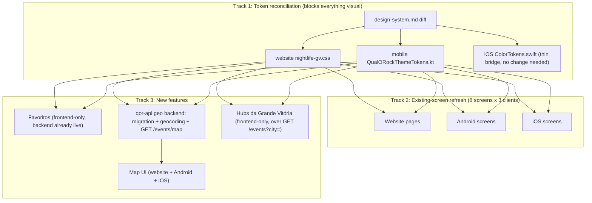

# Nightlife GV Stitch Refresh Design

**Spec**: `.specs/features/nightlife-gv-stitch-refresh/spec.md`
**Status**: Approved

---

## Architecture Overview

Three independent tracks, one shared dependency edge:



Track 1 must land first (every visual task consumes reconciled tokens). Within Track 3, G1 (backend) must merge before G2 (client Map UI) per `ARCHITECTURE.md` §8.11's sequencing rule — this is the one hard cross-repo dependency in the whole feature. Favoritos and Hubs have no such dependency and can proceed in parallel with the screen refresh once tokens are settled.

---

## Approach Exploration: Mapa Interativo geo backend

Three viable approaches were considered:

| Approach | Trade-off |
| --- | --- |
| **A — Plain `latitude`/`longitude` decimal columns + bounding-box `WHERE` query, btree composite index** (chosen) | No new Postgres extension; simple to test/reason about; fits the project's actual scale (4 fixed cities, regional platform) |
| B — PostGIS extension, geography column, `ST_DWithin` | More powerful (true radius/polygon queries) but a new extension with its own ops/migration/backup story, no precedent anywhere in this codebase, solves a scale problem this project doesn't have |
| C — Geocode on-the-fly per map request, no persistence | Avoids a migration but re-geocodes on every map view (latency + Google API cost/rate-limit risk on a frequently-viewed screen); also directly contradicts spec AC MAPGEO-01/04 (coordinates persist on the event) |

**User confirmed Approach A.** Bounding-box query shape: `WHERE latitude BETWEEN :south AND :north AND longitude BETWEEN :west AND :east`, backed by a plain composite btree index on `(latitude, longitude)`. A per-city convenience mode (no explicit box — resolve to a fixed lat/lng radius per `City` enum value) is offered alongside the box params, since the client's Hub/Map entry points will often just want "this city's events," not a client-computed viewport box.

---

## Code Reuse Analysis

### Existing Components to Leverage

| Component | Location | How to Use |
| --- | --- | --- |
| `Event` domain entity + `EventRepository` port | `api/src/Domain/Event/Event.php`, `EventRepository.php` | Extend entity with nullable `latitude`/`longitude`; add a new repository method for the bounding-box query, following the existing eager-load-genre pattern from AD-023 |
| `EventController::index` city-filter pattern | `api/src/Http/Controllers/Api/V1/EventController.php` | New `GET /events/map` controller reuses the same public-event query base, request validation style, and JSON envelope |
| `NotificationSender` interface pattern (domain port, infra adapter) | `ARCHITECTURE.md` §6.1 | Mirror this shape for a new `GeocodingPort` interface + `GoogleGeocodingAdapter` — domain never imports the Google SDK directly, same Clean Architecture discipline already established for FCM/SES |
| `FavoriteController` / `POST /events/{id}/favorite`, `GET /favorites` | `api/routes/api_v1.php` (already routed) | No backend change — website/mobile clients call these directly |
| `GoogleMap.tsx` (website) | `website/components/design-system/GoogleMap.tsx` | Extend from single-pin (event detail) to multi-pin (Map screen) rather than building a second map component |
| `EventMapState.kt` / `EventMapState.swift` | `mobile/androidApp/.../ui/screen/EventMapState.kt`, `mobile/iosApp/.../UI/Screens/EventMapState.swift` | Extend the existing single-event geocoded-point pattern to a multi-event list; same Google Maps SDK already integrated |
| `CityGrid` / `CityFilterBar` (website), `BottomNavDestination` enum (mobile) | `website/components/design-system/`, `mobile/{androidApp,iosApp}/.../BottomNav.*` | Reuse for Hub entry points and to enable the existing disabled `Favoritos` tab |
| `EventCard` component (all 3 clients) | website `components/design-system/EventCard.tsx`, Android/iOS equivalents | Reuse as-is for Favoritos list and Hub list rendering — no new card component |
| `EmptyState` / `PlaceholderImage` | all 3 clients | Reuse for empty Favoritos list, empty Hub, and map-with-no-pins states |
| `ResetPassword` use case + `verifyPasswordResetCode`/`/auth/password/verify-code` endpoint | `mobile/shared/.../ResetPassword.kt`, `qor-api` (already implemented, AD-016) | New shared-module use case (`VerifyPasswordResetCode`) calls the existing endpoint; no new backend work |
| `VerifyEmail`/OTP UI pattern (`OtpCodeInput` website, mobile's existing OTP entry in `EmailVerificationScreen`) | website `components/design-system/OtpCodeInput.tsx`, mobile `EmailVerificationScreen.kt`/`View.swift` | Reuse the same OTP-entry component/pattern for the new password-recovery verify-code step, rather than building a second OTP input |

### Integration Points

| System | Integration Method |
| --- | --- |
| Google Maps/Geocoding API | New `GoogleGeocodingAdapter` (backend, server-side geocoding calls) + existing client-side Google Maps SDK usage (already integrated in `GoogleMap.tsx` and both mobile `EventMapState` files) — same vendor, two different API surfaces (Geocoding API server-side, Maps SDK client-side) |
| `qor-api` public event list | `GET /events/map` sits alongside the existing `GET /events` as a new, additive endpoint — no change to the existing endpoint's contract |
| `mobile/shared` domain layer | New `FavoriteRepository`/`ToggleFavorite`/`ListFavorites` use cases, `MapEventRepository`/`GetMapEvents` use case, `VerifyPasswordResetCode` use case — all follow the existing `EventRepository`/`UserRepository` port+impl+use-case shape already in `shared/src/commonMain/kotlin/domain/` |

---

## Components

### `GeocodingPort` (domain interface) + `GoogleGeocodingAdapter` (infra)

- **Purpose**: Resolve a free-text address to lat/lng, without the domain layer depending on Google's SDK.
- **Location**: `api/src/Domain/Event/GeocodingPort.php` (interface); `api/src/Infrastructure/Geocoding/GoogleGeocodingAdapter.php` (implementation).
- **Interfaces**:
  - `geocode(string $address): ?Coordinates` — returns `null` on failure (not an exception) so callers implement the "save without coordinates, log the failure" behavior from MAPGEO-02 without a try/catch at every call site.
- **Dependencies**: Google Geocoding API key (server-side only, per `ARCHITECTURE.md` §13.3 secrets management — never shipped in client bundles).
- **Reuses**: Same domain-port/infra-adapter shape as `NotificationSender`/`FcmPushSender`/`SesEmailSender` (§6.1).

### `Event` entity extension

- **Purpose**: Carry optional coordinates alongside the existing free-text `address`.
- **Location**: `api/src/Domain/Event/Event.php` (add `?float $latitude`, `?float $longitude`); migration adds nullable `latitude`/`longitude` decimal columns to `events`.
- **Dependencies**: None new — purely additive fields.
- **Reuses**: Existing `Event` construction/validation pattern; follows the same "resolve at construction/save time" discipline AD-023 established for `genreName`.

### `GET /events/map` (new controller action)

- **Purpose**: Return geocoded events within a bounding box or a named city.
- **Location**: `api/src/Http/Controllers/Api/V1/EventController.php` (new `mapEvents` action) or a new `MapController` if the existing controller is already large — decided during Tasks based on actual file size.
- **Interfaces**: `GET /api/v1/events/map?north=&south=&east=&west=` OR `GET /api/v1/events/map?city=<City enum value>` (city resolves to a fixed lat/lng radius server-side — exact radius value lives in `config/qor.php`, no magic number, per §14.2's convention).
- **Dependencies**: `EventRepository`'s new bounding-box query method.
- **Reuses**: Same public/no-auth access pattern as `GET /events` (map browsing doesn't require login, matching the rest of public event discovery).

### `mobile/shared` — Favorites domain slice

- **Purpose**: Toggle/list favorites from both Android and iOS through one shared use case.
- **Location**: `mobile/shared/src/commonMain/kotlin/domain/favorite/` — `Favorite.kt`, `FavoriteRepository.kt` (interface), `usecase/ToggleFavorite.kt`, `usecase/ListFavorites.kt`; impl in `mobile/shared/src/commonMain/kotlin/data/FavoriteRepositoryImpl.kt`.
- **Interfaces**:
  - `ToggleFavorite(eventId: Long): Result<Boolean>` — calls `POST /events/{id}/favorite`, returns the new favorited state.
  - `ListFavorites(): Result<List<Event>>` — calls `GET /favorites`.
- **Reuses**: Same repository-port/impl/use-case shape as `EventRepository`/`EventRepositoryImpl`; same `AuthenticatedHttpClient` already used for authenticated calls.

### `mobile/shared` — Password-recovery verify-code use case

- **Purpose**: Add the missing intermediate step so mobile matches the website's 3-step flow.
- **Location**: `mobile/shared/src/commonMain/kotlin/domain/user/usecase/VerifyPasswordResetCode.kt`.
- **Interfaces**: `VerifyPasswordResetCode(email: String, code: String): Result<Unit>` — calls `qor-api`'s existing `/auth/password/verify-code`.
- **Dependencies**: `UserRepository` gains one new method (`verifyPasswordResetCode`), mirroring the existing `resendVerification`/`verifyEmailCode` pair added for S12b (AD-021).
- **Reuses**: Same OTP-code pattern already built for email verification — `sanitizeOtpInput` and the OTP-entry Compose/SwiftUI components are reused, not rebuilt.

### `mobile/shared` — Map domain slice

- **Purpose**: Fetch geocoded events for the Map screen.
- **Location**: `mobile/shared/src/commonMain/kotlin/domain/event/usecase/GetMapEvents.kt`; extends `EventRepository` with a `getMapEvents(bounds or city)` method.
- **Interfaces**: `GetMapEvents(city: City? = null, bounds: MapBounds? = null): Result<List<Event>>`.
- **Reuses**: Existing `Event` DTO/entity (now carrying optional lat/lng), existing `EventRepositoryImpl` HTTP-call pattern.

### Website — new routes

- **`/favoritos`** (`website/app/favoritos/page.tsx`): reuses `EventCard`, adds `getFavorites`/`toggleFavorite` to `lib/api/client.ts`, gated by the existing `PUBLIC_PATHS` auth pattern (closing the TODO already in `lib/api/http.ts`).
- **`/mapa`** (`website/app/mapa/page.tsx`): extends `GoogleMap.tsx` to multi-pin mode, adds `getMapEvents` to `lib/api/client.ts`.
- **Hub route(s)** (exact URL shape decided in Tasks — candidate: `/hubs/[city]`): reuses `CityGrid`/`CityFilterBar` styling, calls the existing `listEvents({ city })`.

### Android/iOS — new screens

- **`FavoritesScreen.kt` / `FavoritesView.swift`**: wired into the existing disabled `BottomNavDestination.Favoritos`/`.favoritos` tab (replacing the stub/`EmptyView()`), reusing the existing event-card Composable/SwiftUI view.
- **`MapScreen.kt` / `MapView.swift`**: new nav-graph route (`map` on Android, a new case in `AppNavigation.swift`'s authenticated stack on iOS), extending the `EventMapState` pattern to multiple pins.
- **`HubScreen.kt` / `HubView.swift`** (or per-city variants — exact shape decided in Tasks): new nav-graph route(s), reusing `EventCard`.
- **`PasswordRecoveryScreen.kt` / `PasswordRecoveryView.swift`**: restructured into 3 real steps (currently 2), consuming the new `VerifyPasswordResetCode` use case for the middle step.

---

## Data Models

### `Event` (extended)

```
id, ..., address (existing, unchanged),
latitude (nullable, decimal(10,7)),   // new
longitude (nullable, decimal(10,7)),  // new
...
```

**Relationships**: unchanged — this is a pure field addition, no new FK.

### `MapBounds` (backend request DTO / shared-module value type, not persisted)

```typescript
interface MapBounds {
  north: number
  south: number
  east: number
  west: number
}
```

Used only as a request-shape value object on both the `qor-api` controller (Form Request validation) and `mobile/shared`'s `GetMapEvents` use case parameter — not a database entity.

---

## Error Handling Strategy

| Error Scenario | Handling | User Impact |
| --- | --- | --- |
| Geocoding fails (address unresolvable, API error/timeout) | `GeocodingPort::geocode()` returns `null`; event saves with `latitude`/`longitude` left `null`; failure logged server-side (existing logging convention) | None visible at save time — the event just doesn't appear on the map until re-geocoded |
| `GET /events/map` called with an invalid/missing bounding box and no `city` | Form Request validation rejects with the existing 422 envelope (`ARCHITECTURE.md` §3) | pt-BR validation message, same shape as every other endpoint |
| Favorite toggle fails (network, 401 for an expired session) | Optimistic UI update rolls back to server-confirmed state on error | Toast/inline error, favorite state visually reverts |
| Map screen has zero geocoded events in view | Empty map (no pins), no error — this is a valid state, not a failure | Existing `EmptyState` pattern if the client wants an overlay hint, otherwise just an empty map |
| Password-recovery verify-code entered wrong/expired | `VerifyPasswordResetCode` returns a `Result` failure; screen shows pt-BR error, allows retry/resend, does not advance | Stays on the code-entry step |

---

## Risks & Concerns

| Concern | Location (file:line) | Impact | Mitigation |
| --- | --- | --- | --- |
| `nightlife-gv.css`'s `@theme` token block is currently unconsumed — every website component uses raw Tailwind arbitrary-hex classes instead of the generated `bg-nightlife-*`/`text-nightlife-*` utilities (flagged in `STATE.md` Todos, tied to AD-015) | `website/styles/nightlife-gv.css` | Not a defect this feature introduces, but every new/touched component in this pass (existing-screen refresh + 3 new features) is an opportunity to either perpetuate the raw-hex pattern or finally consume the theme utilities | Out of scope for this pass's token-reconciliation story (which is about *values*, not *consumption mechanism*) — stays a documented Todo. New components should follow whatever the majority pattern is at time of writing to avoid a half-migrated inconsistency mid-feature. |
| Geocoding a real address to lat/lng depends on an external Google API call inside (or triggered by) the event create/update request path | `api/src/Domain/Event/*` (new) | If synchronous, a slow/failed geocoding call could add latency or (if mis-implemented) block event save entirely | Design mandates non-blocking failure (AC MAPGEO-02: save proceeds, coordinates null, failure logged) — never let geocoding failure block the write. Whether the call itself is synchronous-but-fire-and-forget-on-failure or queued is a Tasks-phase implementation detail, not a design gate. |
| `mobile`'s `PasswordRecoveryScreen`/`View` restructuring from 2→3 steps touches an already-shipped, tested screen (A10/AD-021) | `mobile/androidApp/.../PasswordRecoveryScreen.kt`, `mobile/iosApp/.../PasswordRecoveryView.swift` | Regression risk on an existing, working flow | Existing tests for the 2-step flow must be replaced (not just extended) with tests for the real 3-step flow per TDD's RED→GREEN→REFACTOR — this is treated as a real behavior change, not additive |
| The new `GET /events/map` endpoint is public/no-auth (matching `GET /events`) but returns precise coordinates, which is more granular location data than the existing city-only public list | `api/src/Http/Controllers/Api/V1/EventController.php` (new action) | Low — event locations are already semi-public (venue names/addresses are shown on Event Detail today), so this isn't new PII exposure, just a new query shape over already-public data | No mitigation needed beyond what's already true of the existing public Event Detail address display; noted here so it isn't mistaken for an oversight |

---

## Tech Decisions (only non-obvious ones)

| Decision | Choice | Rationale |
| --- | --- | --- |
| Geo storage/query shape | Plain nullable `latitude`/`longitude` columns + bounding-box `WHERE` + composite btree index | User-confirmed (Approach Exploration above) — matches project scale, no new Postgres extension |
| Geocoding integration shape | New `GeocodingPort` domain interface + `GoogleGeocodingAdapter` infra implementation | Mirrors the existing `NotificationSender`/FCM/SES pattern (§6.1) — keeps the domain layer framework/vendor-free per Clean Architecture (§8.5) |
| Password-recovery fix scope | Real 3-step parity (new shared-module `VerifyPasswordResetCode` use case), not a re-skin of the 2-step flow | User-confirmed in Discuss |
| Hubs vs. Explore | Hubs is additive, `/eventos` untouched | User-confirmed in Discuss |
| City-radius default for map "city mode" queries | A config-driven radius per `City` enum value in `config/qor.php` (exact km value decided in Tasks) | Follows §14.2's "every numeric threshold in config, never inlined" convention |

> **Project-level decision to record in STATE.md after implementation:** the `GeocodingPort`/adapter pattern for Google Geocoding API integration becomes the project's reference shape for any future external-API integration needing the same domain/infra split — worth its own `AD-###` entry alongside the feature's completion entry.

## T1 Token Audit — Delta List

Diffed `design-system.md`, `website/styles/nightlife-gv.css`, `mobile/shared/.../QualORockThemeTokens.kt`, and `mobile/iosApp/.../ColorTokens.swift` line-by-line against the "Nightlife Discovery" Stitch design system's `designMd` (fetched live via `mcp__stitch__list_design_systems`, project `6008587636717635180`).

**Result: zero real deltas.**

- **Colors**: every surface/text/accent hex in all four files matches Stitch's `designMd` exactly — `bg-deep #0B0D14`, `bg-base #12141D`, `surface-card #1B1E29`, `surface-card-hover #232733`, `border-subtle #2A2E3B`, `text-primary #F5F6FA`, `text-secondary #9A9FB0`, `text-tertiary #666B7D`, `accent-pink #FF2E7E`, `accent-orange #FF8A1E`, `accent-purple #B14EFF`, `accent-blue #2EC5FF`, `danger #FF4D4D`.
- **Typography**: nearest size+weight mapping (per the spec's agreed mapping rule) lines up with Stitch's scale for every existing role — `text-event-title` (22px/700) ↔ `headline-md`, `text-event-title-lg` (32px/700) ↔ `headline-lg`, `text-venue-name` (15px/600) ↔ `label-venue`, `text-city-label` (12px/600/uppercase) ↔ `label-caps`, `text-metadata` (13px/500) ↔ `body-sm`, `text-badge` (11px/600/uppercase) ↔ `badge-tag`, `text-body` (14px/400) ↔ `body-md`, `text-button` (14px/600) ↔ `label-btn`. Stitch has four roles with no current mapping (`display-hero`, `display-hero-mobile`, `headline-sm`, `title-card`) — per context.md, left undefined; added only if a later screen-refresh task's structural diff needs one.
- **Spacing**: `4/8/16/24/32/48/64px` (space-1..7) matches Stitch's `space-xxs..space-3xl` exactly.
- **Radius**: `md` (12px) and `lg` (16px) match Stitch's `md`/`lg`. `sm` stays at 6px vs. Stitch's 4px — logged assumption in spec.md/context.md, agent judgment call, not changed here.

No file edits were required — all four surfaces were already reconciled before this task ran.
