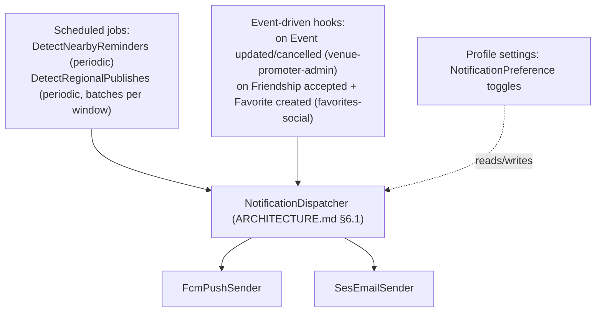

# Notifications Design

**Spec**: `.specs/features/notifications/spec.md`
**Architecture**: `.specs/project/ARCHITECTURE.md` §4 (`NotificationPreference`/`NotificationLog`), §6.1 (`NotificationDispatcher` pattern, provider choice), §14 (constants/enums) — this design elaborates §6.1 into feature-level detail rather than repeating it.
**Status**: Draft

---

## Architecture Overview

This feature has almost no direct user-facing CRUD of its own — its preference toggles live on the fan's profile settings (extending `auth-fan-profile`'s AUTH-24 stub into the full `NotificationPreference` model). Its substance is the **dispatch pipeline**: trigger detection → `NotificationDispatcher` (ARCHITECTURE.md §6.1) → provider adapters → delivery.

**Resolved decisions applied in this design** (from this session's AskUserQuestion):
- Overlapping triggers for the same fan+event **consolidate** into one `NotificationDispatcher` send — implemented via the `NotificationLog` check already specified in ARCHITECTURE.md §6.1 (step 2).
- New-regional-event publishes **batch** into one digest per fan per window, rather than one notification per event — implemented by `DetectRegionalPublishes` collecting all qualifying events in its scan window (`qor.notifications.regional_batch_window_minutes`, ARCHITECTURE.md §14.2) before calling `NotificationDispatcher` once per fan, not once per event.

---

## Code Reuse Analysis

### Existing Components to Leverage

| Component | Location | How to Use |
|---|---|---|
| `NotificationDispatcher`, `NotificationSender` interface, `FcmPushSender`/`SesEmailSender` | ARCHITECTURE.md §6.1 | This feature *is* the primary consumer/elaborator of that pattern — the detectors below are the only new pieces; the dispatcher itself isn't redefined here |
| `UserAddress`/search radius | `auth-fan-profile/design.md` (AUTH-20–AUTH-23 data fields) | `DetectNearbyReminders`/`DetectRegionalPublishes` read these to scope geofenced triggers; fans with no address/radius are skipped (NOTIF-03/NOTIF-18) |
| `Favorite`, `Friendship` | `favorites-social/design.md` | Event-driven hooks fire off `Friendship` acceptance (P2 friend-interest) and `Favorite` creation; `NOTIF-01`'s reminder reads a fan's `Favorite` rows |

### Integration Points

| System | Integration Method |
|---|---|
| `venue-promoter-admin`'s `Event` update/cancel/force-cancel actions | Emit a domain event (`EventChanged`, `EventCancelled`) that an event-driven hook subscribes to, calling `NotificationDispatcher` for every fan who favorited that event — this feature doesn't modify `venue-promoter-admin/design.md`'s use cases, it listens to their outcome |
| `favorites-social`'s `SendFriendRequest`/`ToggleFavorite` | Same pattern — those use cases already call `NotificationDispatcher` directly per `favorites-social/design.md`; this feature owns what happens *inside* that call (preference check, dedup, send) |

---

## Components

### `NotificationPreference` / `NotificationLog` (domain entities)
- **Purpose**: Per ARCHITECTURE.md §4.
- **Location**: `src/Domain/Notification/NotificationPreference.php`, `src/Domain/Notification/NotificationLog.php`

### `DetectNearbyReminders` (domain use case, scheduled)
- **Purpose**: NOTIF-01–NOTIF-04 — for each fan with an address/radius and at least one favorited event approaching within `qor.notifications.nearby_reminder_lead_hours` (ARCHITECTURE.md §14.2 — not a hardcoded number in this use case), and not already logged for that event/trigger (`NotificationTriggerType::NearbyReminder`), call `NotificationDispatcher`.
- **Location**: `src/Domain/Notification/UseCase/DetectNearbyReminders.php`
- **Interfaces**: `execute(): void` (invoked by a scheduled job adapter at an interval also read from config, not hardcoded in the job scheduler)
- **Dependencies**: `FavoriteRepository` (favorites-social), `UserAddressRepository` (auth-fan-profile), `NotificationDispatcher`

### `DetectRegionalPublishes` (domain use case, scheduled, P2)
- **Purpose**: NOTIF-16–NOTIF-19 — collect events newly `Published` within each fan's radius since the last scan, batch per fan into one digest call (resolved decision #2), skip fans with no address/radius.
- **Location**: `src/Domain/Notification/UseCase/DetectRegionalPublishes.php`
- **Interfaces**: `execute(): void`
- **Dependencies**: `EventRepository` (event-discovery), `UserAddressRepository`, `NotificationDispatcher`

### `HandleEventChangedOrCancelled` (domain use case, event-driven)
- **Purpose**: NOTIF-05–NOTIF-08 — on a material `Event` change or cancellation (organizer- or Super-Admin-initiated), notify every favoriting fan, always firing regardless of that fan's other per-trigger opt-outs (but still subject to global silence).
- **Location**: `src/Domain/Notification/UseCase/HandleEventChangedOrCancelled.php`
- **Interfaces**: `handle(eventId, changeType: NotificationTriggerType): void` (only `EventChanged`/`EventCancelled` cases apply here — ARCHITECTURE.md §14.1 enum, not a `'changed'|'cancelled'` string union) — subscribed to the `EventChanged`/`EventCancelled` domain events emitted by `venue-promoter-admin`'s use cases
- **Dependencies**: `FavoriteRepository`, `NotificationDispatcher`

### `HandleFriendInterest` (domain use case, event-driven, P2)
- **Purpose**: NOTIF-13–NOTIF-15 — on a `Favorite` created by a user with an accepted `Friendship` to others, notify those friends (per-trigger opt-out respected, stops firing once the friendship is removed).
- **Location**: `src/Domain/Notification/UseCase/HandleFriendInterest.php`
- **Interfaces**: `handle(favoritedByUserId, eventId): void` — subscribed to `FavoriteCreated`
- **Dependencies**: `FriendshipRepository`, `NotificationDispatcher`

### `UpdateNotificationPreference` (domain use case)
- **Purpose**: Extends AUTH-24's stub into full per-channel/global-silence/per-trigger toggle persistence.
- **Location**: `src/Domain/Notification/UseCase/UpdateNotificationPreference.php`
- **Interfaces**: `execute(userId, preferences): NotificationPreference`
- **Dependencies**: `NotificationPreferenceRepository`

### `FcmPushSender` / `SesEmailSender` (infrastructure adapters)
- **Purpose**: Implement `NotificationSender` (ARCHITECTURE.md §6.1) — the only place FCM/SES SDK calls happen.
- **Location**: `src/Infrastructure/Notification/{FcmPushSender,SesEmailSender}.php`
- **Dependencies**: FCM SDK, AWS SES SDK (infrastructure layer only — never imported by domain)

### `NotificationPreferenceController` (infrastructure adapter)
- **Location**: `src/Http/Controllers/Api/V1/NotificationPreferenceController.php`
- **Interfaces**: `GET/PATCH /api/v1/profile/notification-preferences`

### Notification-preference UI
- **Purpose**: Extends `auth-fan-profile`'s profile settings screen with per-trigger toggles (nearby, changed/cancelled shown but non-togglable per NOTIF-07, friend interest, new regional), channel toggles, global silence.
- **Location**: mobile/web profile settings screens

---

## Data Models

Reuses `NotificationPreference`, `NotificationLog` from ARCHITECTURE.md §4 exactly. No new tables.

---

## Error Handling Strategy

| Error Scenario | Handling | User Impact (pt-BR) |
|---|---|---|
| No address/radius set | Detector skips the fan for that scan | No notification — not an error, per NOTIF-03/NOTIF-18 |
| Global silence enabled | `NotificationDispatcher` short-circuits before any send | No notification, no exception raised |
| Duplicate trigger for same fan+event | `NotificationLog` check prevents a second send | Single notification, per the consolidation decision |
| Provider send failure (FCM/SES error) | Caught at the adapter, logged internally, not surfaced to the fan; bounded retry policy (attempt count/backoff — exact values a Tasks-phase detail) | Fan sees nothing; ops sees a logged failure via the audit-logging hook (ARCHITECTURE.md §13.4) |
| Fan disables all per-trigger toggles individually | Behaves identically to global silence for that fan (spec Edge Case) — `NotificationDispatcher`'s per-trigger check naturally produces this, no special-cased logic needed | No notifications sent, despite `silence_all` being technically false |

Notification body copy (push/email) is pt-BR per ARCHITECTURE.md §9 — this is content data (a template), not a form, so "client-side validation" doesn't apply here; the preference-toggle screen itself has no free-text fields to validate.

---

## Analytics — GA4 Events

Per ARCHITECTURE.md §11/§14.4 (each event below is a named constant in the `AnalyticsEvents` registry, never a literal at the call site). **Note**: notification delivery/open/tap events are typically observed through the push provider's own analytics (FCM delivery reports) or platform-level tooling, not GA4 web/app instrumentation — this design does not invent GA4 events for a channel GA4 doesn't directly see. The one in-app surface GA4 *does* cover is the preference-toggle screen itself:

| Event | Fired when |
|---|---|
| `click:notificacoes:alternar-canal` | Fan toggles push or email on/off |
| `click:notificacoes:alternar-gatilho` | Fan toggles a specific trigger on/off |
| `click:notificacoes:silenciar-tudo` | Fan enables global silence |

Seed list — implementation gated on tracking-spreadsheet approval, same as every other feature.

---

## Tech Decisions (non-obvious only)

| Decision | Choice | Rationale |
|---|---|---|
| Overlapping-trigger handling | Consolidate via `NotificationLog` check, not separate send paths | Design decision (2026-08-27, this session) — avoids spamming a fan when two triggers land for the same event |
| Regional-publish batching | Digest per fan per scan window, not per-event | Design decision (2026-08-27, this session) — avoids notification flooding when several events publish close together |
| Detection mechanism | Scheduled jobs for time/geo-based triggers, domain events for state-change triggers | Matches the nature of each trigger — "soon" and "batched region" need periodic evaluation; "changed" and "friend favorited" are point-in-time state transitions best modeled as events, not polled |
| Send-failure handling | Logged + retried, never surfaced to the fan as an error | A failed push/email isn't the fan's fault and there's no UI action for them to take in response |
| Trigger types, channels, lead time, batch window | `NotificationTriggerType`/`NotificationChannel` backed enums + `qor.notifications.*` config (ARCHITECTURE.md §14) | No detector or the dispatcher ever compares against a raw trigger-name string or an inlined hour/minute value |

---

## Requirement Coverage

NOTIF-01–NOTIF-12 (P1) map to `DetectNearbyReminders`, `HandleEventChangedOrCancelled`, and `NotificationDispatcher`'s preference-enforcement logic (ARCHITECTURE.md §6.1). NOTIF-13–NOTIF-23 (P2) map to `HandleFriendInterest`, `DetectRegionalPublishes`, and `UpdateNotificationPreference`'s per-trigger toggle support.
