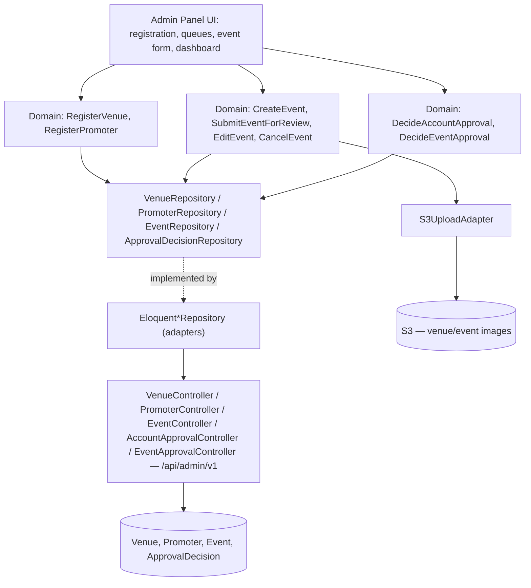

# Venue/Promoter Admin + Approval Workflow Design

**Spec**: `.specs/features/venue-promoter-admin/spec.md`
**Architecture**: `.specs/project/ARCHITECTURE.md` (auth §2, API split §3, data models §4, event state machine §5, approval pattern §6, security §13, constants/enums §14 — referenced, not repeated here)
**Status**: Draft

---

## Architecture Overview

Admin-panel surface, entirely under `/api/admin/v1`, gated by the admin Sanctum guard (distinct from the fan guard in `auth-fan-profile/design.md`). Covers registration → approval → event CRUD → submit → publish queue.

**State machine**: reuses ARCHITECTURE.md §5 exactly, including the Design decision that a rejected event auto-returns to `Draft` (no separate `Rejected` event state — distinct from the `Venue`/`Promoter` account `ApprovalStatus` enum, which does keep a `Rejected` case). All status/type comparisons in this feature's use cases (`EventStatus`, `ApprovalStatus`, `ApprovalDecidableType`, `ApprovalOutcome`, `EventCreatedByType`) go through the backed enums defined in ARCHITECTURE.md §14.1 — never a raw string.

---

## Code Reuse Analysis

### Existing Components to Leverage

| Component | Location | How to Use |
|---|---|---|
| Consent-capture UI component | `auth-fan-profile/design.md` | Reused as-is for Venue/Promoter self-registration's terms acceptance (ADMIN-02/ADMIN-06) — same LGPD Art. 7 shape, no reimplementation |
| `S3UploadAdapter` | `auth-fan-profile/design.md` | Same upload/validate/forward-to-S3 adapter, reused for venue images and event cover images, not reimplemented per entity |
| `ApprovalDecision` shape | ARCHITECTURE.md §6 | One polymorphic entity/repository backs both `DecideAccountApproval` and `DecideEventApproval` below, rather than two separate audit tables |
| `Event` entity, event read model | `event-discovery/design.md` | Write side defined here creates/updates the same `Event` row the public `/api/v1` read side (event-discovery) serves — one entity, two adapter surfaces |

### Integration Points

| System | Integration Method |
|---|---|
| Event Discovery's public API | Publishing an event here (`status → Published`) makes it immediately visible via `event-discovery/design.md`'s `ListUpcomingEvents` — no separate sync step, same `Event` table |
| S3/CDN | Venue/event image upload via `S3UploadAdapter`, per ARCHITECTURE.md §10 |

---

## Components

### `Venue` / `Promoter` (domain entities)
- **Purpose**: Per ARCHITECTURE.md §4, including `approval_status`.
- **Location**: `src/Domain/Venue/Venue.php`, `src/Domain/Promoter/Promoter.php`

### `RegisterVenue` / `RegisterPromoter` (domain use cases)
- **Purpose**: ADMIN-01–ADMIN-06 — self-registration into `Pending Approval`, consent capture, required-field validation, duplicate-email rejection.
- **Location**: `src/Domain/Venue/UseCase/RegisterVenue.php`, `src/Domain/Promoter/UseCase/RegisterPromoter.php`
- **Interfaces**: `execute(registrationFields, consentAcceptance): Venue|Promoter`
- **Dependencies**: `VenueRepository`/`PromoterRepository`, `ConsentRepository` (shared with auth-fan-profile)

### `DecideAccountApproval` (domain use case)
- **Purpose**: ADMIN-07–ADMIN-10, ADMIN-27 — Super Admin approve/reject/suspend/lift-suspension on a Venue or Promoter account, auditable.
- **Location**: `src/Domain/Approval/UseCase/DecideAccountApproval.php`
- **Interfaces**: `execute(accountType, accountId, outcome, reason?, decidedBy): ApprovalDecision`
- **Dependencies**: `VenueRepository`/`PromoterRepository`, `ApprovalDecisionRepository`

### `CreateEvent` (domain use case)
- **Purpose**: ADMIN-11–ADMIN-13 — create as `Draft`, Promoter enters own location vs. Venue Admin defaults to registered address, blocks unapproved accounts.
- **Location**: `src/Domain/Event/UseCase/CreateEvent.php`
- **Interfaces**: `execute(createdByType, createdById, eventFields): Event`
- **Dependencies**: `EventRepository`, `VenuePolicy`/`PromoterPolicy` (approval-status check), `S3UploadAdapter` (cover image)

### `SubmitEventForReview` (domain use case)
- **Purpose**: ADMIN-14–ADMIN-15, ADMIN-20 — `Draft → Pending Review` transition with required-field validation and unapproved-account blocking.
- **Location**: `src/Domain/Event/UseCase/SubmitEventForReview.php`
- **Interfaces**: `execute(eventId, submittedBy): Event`
- **Dependencies**: `EventRepository`, `EventPolicy`

### `DecideEventApproval` (domain use case)
- **Purpose**: ADMIN-16–ADMIN-19, ADMIN-22 — Super Admin approve (`→ Published`) / reject (`→ Draft`, feedback attached) / force-cancel, auditable.
- **Location**: `src/Domain/Approval/UseCase/DecideEventApproval.php`
- **Interfaces**: `execute(eventId, outcome, feedback?, decidedBy): ApprovalDecision`
- **Dependencies**: `EventRepository`, `ApprovalDecisionRepository`

### `EditEvent` / `DuplicateEvent` / `CancelEvent` (domain use cases, P2)
- **Purpose**: ADMIN-21, ADMIN-22 — edit own draft/rejected-now-draft event; non-critical-field edit on published events without re-review; duplicate as new draft; organizer/Super-Admin cancellation.
- **Location**: `src/Domain/Event/UseCase/{EditEvent,DuplicateEvent,CancelEvent}.php`
- **Dependencies**: `EventRepository`, `EventPolicy` (ownership check — ADMIN-24's "tagged promoter can't edit" enforced here)

### `EventPolicy` / `VenuePolicy` / `PromoterPolicy` (authorization, per ARCHITECTURE.md §2)
- **Purpose**: Ownership and approval-status gating — a `Pending Approval`/suspended account is blocked from every write action (ADMIN-20); a tagged promoter without ownership can't edit (ADMIN-24).
- **Location**: `src/Http/Policies/{Event,Venue,Promoter}Policy.php` — Laravel Policy classes, invoked by controllers, not hand-rolled `if` checks

### `VenueController` / `PromoterController` / `EventController` / `AccountApprovalController` / `EventApprovalController` (infrastructure adapters)
- **Purpose**: HTTP boundary, all under `/api/admin/v1`, distinct from event-discovery's public `EventController` under `/api/v1`.
- **Location**: `src/Http/Controllers/Api/AdminV1/*.php`
- **Interfaces**:
  - `POST /api/admin/v1/venues/register`, `POST /api/admin/v1/promoters/register`
  - `GET/POST/PATCH/DELETE /api/admin/v1/events`, `POST /api/admin/v1/events/{id}/submit`, `POST /api/admin/v1/events/{id}/duplicate`, `POST /api/admin/v1/events/{id}/cancel`
  - `GET /api/admin/v1/approvals/accounts`, `POST /api/admin/v1/approvals/accounts/{id}/decide`
  - `GET /api/admin/v1/approvals/events`, `POST /api/admin/v1/approvals/events/{id}/decide`
  - `GET /api/admin/v1/dashboard` (P2 — per-event stats)

### Admin-panel queue UI components
- **Purpose**: One reusable table+decision-action component pattern, parameterized for account-approval vs. event-approval queues (list, detail expand, approve/reject with optional reason/feedback).
- **Location**: `qor-admin` Next.js components

---

## Data Models

Reuses `Venue`, `Promoter`, `Event`, `ApprovalDecision` from ARCHITECTURE.md §4 exactly — no new tables. This feature is the write-side owner of `Event`/`Venue`/`Promoter`; event-discovery is read-only against the same rows.

---

## Error Handling Strategy

| Error Scenario | Handling | User Impact (pt-BR) |
|---|---|---|
| Duplicate registration email (Venue or Promoter) | Rejected before account creation | "Este e-mail já está cadastrado" |
| Required field missing on registration | Field-specific validation errors | e.g. "O endereço é obrigatório" |
| Required field missing on event submit (e.g. no ticket link on paid event) | Field-specific validation errors, submission blocked | e.g. "Informe o link do ingresso para eventos pagos" |
| Unapproved/suspended account attempts create/edit/submit | `EventPolicy`/`VenuePolicy` blocks before the use case runs | "Sua conta ainda não foi aprovada" / "Sua conta está suspensa" |
| Tagged promoter attempts to edit an event they don't own | `EventPolicy` ownership check | "Você não tem permissão para editar este evento" |
| Rejection/suspension with no reason/feedback entered | Allowed — reason/feedback optional, not required | Decision recorded without a reason field |
| Event's date passes while still `Pending Review`, later approved | `DecideEventApproval` immediately marks it `Encerrado` instead of `Published` if the date has passed by decision time | Organizer sees `Encerrado`, not a live "upcoming" event |

Client-side validation before submit: registration forms (venue/promoter) validate required fields and email format; event-creation/submit form validates required fields, ticket-link URL format (required only when `is_free` is false), capacity/age-rating as numeric — all mirroring the API's Form Request rules, all copy in pt-BR.

---

## Analytics — GA4 Events

Per ARCHITECTURE.md §11/§14.4 (each event below is a named constant in the `AnalyticsEvents` registry, never a literal at the call site). Seed list — implementation gated on tracking-spreadsheet approval:

| Event | Fired when |
|---|---|
| `submit:cadastro-local:criar-conta` | Venue Admin completes self-registration |
| `submit:cadastro-promotor:criar-conta` | Promoter completes self-registration |
| `click:fila-aprovacao:aprovar-conta` | Super Admin approves a pending account |
| `click:fila-aprovacao:rejeitar-conta` | Super Admin rejects a pending account |
| `submit:evento-form:enviar-revisao` | Organizer submits an event for review |
| `click:fila-publicacao:aprovar-evento` | Super Admin approves an event |
| `click:fila-publicacao:rejeitar-evento` | Super Admin rejects an event |

---

## Tech Decisions (non-obvious only)

| Decision | Choice | Rationale |
|---|---|---|
| Rejected-event handling | Auto-return to `Draft`, feedback attached | Design decision (resolved 2026-08-27) — one editable state instead of `Draft`+`Rejected` duplicating the same "organizer can edit" behavior |
| Authorization mechanism | Laravel Policies, not inline controller checks | ARCHITECTURE.md §2 — keeps ownership/approval-status rules centralized and testable in isolation from HTTP concerns |
| Account vs. event approval audit | One polymorphic `ApprovalDecision`, not two tables | ARCHITECTURE.md §6 — both need the identical who/when/outcome/reason shape |
| Field length/format limits (name, description, capacity range, etc.) | Config-driven Form Request rules, not hardcoded per-field constants scattered in migrations/validators | ARCHITECTURE.md §14.2 — one source per limit, referenced by both the migration and the Form Request |

---

## Requirement Coverage

ADMIN-01–ADMIN-20 (all P1) map to `RegisterVenue`/`RegisterPromoter`, `DecideAccountApproval`, `CreateEvent`, `SubmitEventForReview`, `DecideEventApproval`, and their policies/controllers above. ADMIN-21–ADMIN-27 (P2) map to `EditEvent`/`DuplicateEvent`/`CancelEvent`, the natural-`Encerrado`-transition edge case, promoter tagging (`EventPromoter`, already modeled in ARCHITECTURE.md §4), venue/promoter profile management (extends `RegisterVenue`/`RegisterPromoter`'s repositories with an update path), the dashboard endpoint, and account suspension (folded into `DecideAccountApproval`'s outcome enum).
