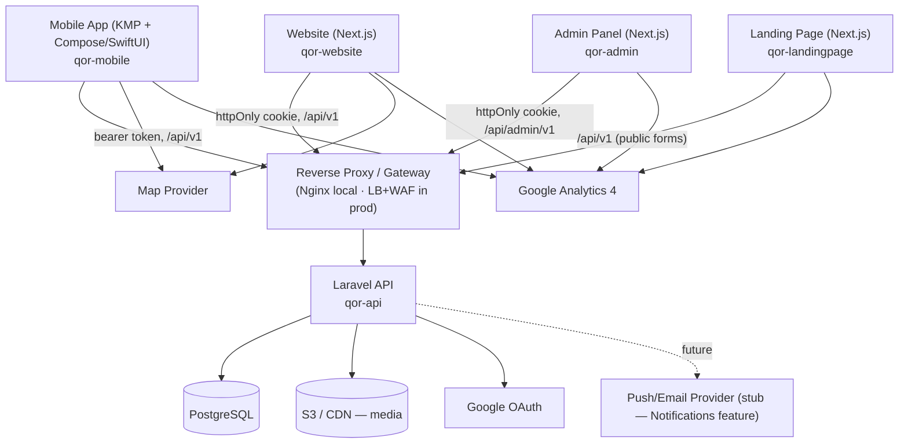
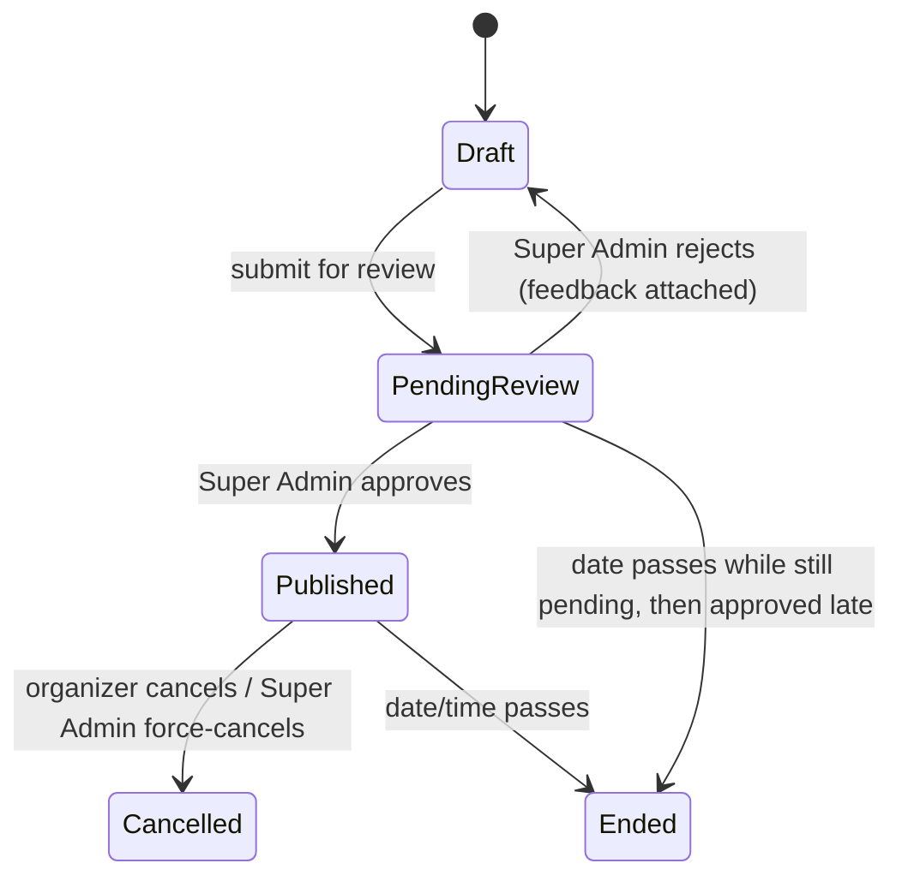
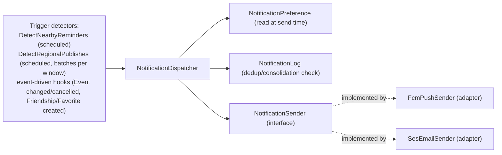

# QOR — System Architecture

**Status**: Draft
**Feeds**: `.specs/features/event-discovery/design.md`, `.specs/features/auth-fan-profile/design.md`, `.specs/features/venue-promoter-admin/design.md` (MVP Core); `.specs/features/favorites-social/design.md`, `.specs/features/notifications/design.md` (Social & Notifications); `.specs/features/monetization/design.md` (Monetization); and every feature design that follows.

This document records cross-cutting decisions that every feature design references instead of re-deriving. It is a living doc — later milestones (Favorites & Social, Notifications, Monetization) extend it, they don't replace it.

---

## 1. System Overview



**Repository topology**: 6 git repos — root `QOR` (this workspace) plus 5 submodules: `qor-api`, `qor-mobile`, `qor-admin`, `qor-landingpage`, `qor-website`. The publishing-plans landing page (PRD §5.8) lives in its own `qor-landingpage` repo, distinct from `qor-website`. All work in every submodule starts from that submodule's `main` branch.

---

## 2. Auth Mechanism

Laravel Sanctum, split by client type:

- **Mobile** (`qor-mobile`): Sanctum personal-access **bearer tokens**, stored in platform secure storage (iOS Keychain / Android EncryptedSharedPreferences) — never plain app storage.
- **Website / Admin / Landing** (`qor-website`, `qor-admin`, `qor-landingpage`): Sanctum **SPA cookie mode** — an `httpOnly`, `Secure`, `SameSite` session cookie. **Never** a JWT/token in `localStorage`/`sessionStorage`.
- **Two guards, not one shared table**: Fan accounts and Venue Admin/Promoter/Super Admin accounts are separate credential spaces (PRD §3) — a fan token/cookie cannot authenticate against `/api/admin/v1`, and vice versa.

**Tech Decision — opaque Sanctum tokens over JWT/OIDC**: chosen for revocability (a compromised/stale token is killed server-side instantly; a self-contained JWT lives until expiry without extra blocklist infrastructure). Google login already covers the OAuth 2.0 federated-identity need this project has.

**Authorization**: Laravel Policies/Gates, one per entity (`EventPolicy`, `VenuePolicy`, etc.) — not ad hoc controller `if` checks. This is what implements rules like "a tagged promoter can't edit the event they're tagged on" (ADMIN-24) and "an unapproved account is blocked from every write action" (ADMIN-20).

---

## 3. API Conventions

- **Route split** (explicit requirement): `/api/v1/...` serves end-user surfaces (mobile app, website, landing page — public/fan-facing traffic). `/api/admin/v1/...` serves the admin panel (Venue Admin/Promoter/Super Admin traffic). Enforced via separate Laravel route files/groups **and** separate Sanctum guards — an end-user token must not authenticate against admin routes, and vice versa. This is a hard boundary, not just a URL naming convention.
- **Versioning**: `v1` in the path, as above. A breaking change ships as `v2` alongside `v1`, not an in-place break.
- **Pagination**: cursor-based for the public event list (`/api/v1/events`), since it's a live, frequently-changing, infinite-scroll feed where offset-based pagination would skip/duplicate items as new events publish mid-scroll. Admin queues (`/api/admin/v1/...`) use simple page-based pagination — bounded, operator-driven lists where cursor complexity isn't worth it.
- **Error envelope**: `{ "message": "<pt-BR message>", "errors": { "<field>": ["<pt-BR reason>"] } }` for validation errors (HTTP 422); `{ "message": "<pt-BR message>" }` for all other errors. No stack traces or internal exception details ever appear in a response body (`APP_DEBUG=false` outside local dev) — see Security §8.

---

## 4. Core Data Models

From PRD §7, elaborated to field level. Only entities MVP Core needs; `Favorite`/`Friendship`/`NotificationPreference`/`Plan`/`Subscription` are named only as forward references for foreign keys and belong to later features.

### User (fan)
```
id, name, email, email_verified_at, password_hash (null if Google-only),
google_id (nullable), phone (nullable), profile_picture_url (nullable, S3),
birthdate, favorite_genres (json, nullable — P2), search_radius_km (nullable — P2),
created_at, updated_at, deleted_at (soft delete for LGPD cascade)
```

### UserAddress
```
id, user_id (FK), city, state, street/number/complement (nullable — manual entry),
latitude (nullable), longitude (nullable), source (enum: manual | device_location),
created_at, updated_at
```

### UserPreferences
```
id, user_id (FK), push_enabled, email_enabled, silence_all,
created_at, updated_at
```
*(fields beyond notification toggles are P2/out of MVP Core scope)*

### Venue
```
id, venue_admin_user_id (FK, 1:1), name, description, address, city,
contact_phone, contact_email, image_url (nullable, S3),
approval_status (enum: pending_approval | approved | rejected | suspended),
created_at, updated_at
```

### Promoter
```
id, user_id (FK, 1:1), name, phone, email, instagram (nullable), tiktok (nullable),
approval_status (enum: pending_approval | approved | rejected | suspended),
created_at, updated_at
```

### Event
```
id, created_by_type (enum: venue_admin | promoter), created_by_id (FK, polymorphic to Venue/Promoter),
title, description, cover_image_url (S3), starts_at, city, genre,
address (own field for Promoter-created events; defaults from Venue for Venue-created events),
is_free, ticket_url (nullable — required if !is_free), capacity (nullable),
age_rating (nullable, informational-only in MVP Core), notes (nullable),
status (enum: draft | pending_review | published | cancelled | ended),
rejection_feedback (nullable — cleared on next submission),
created_at, updated_at
```

### EventPromoter (join)
```
event_id (FK), promoter_id (FK), tagged_at
```

### ApprovalDecision
```
id, decidable_type (enum: venue | promoter | event), decidable_id (polymorphic FK),
decided_by_user_id (FK, Super Admin), outcome (enum: approved | rejected | suspended | force_cancelled),
reason (nullable), decided_at
```
One shape, reused for account approval (Venue/Promoter) and event approval — see §5.

### Favorite *(added — Social & Notifications)*
```
id, user_id (FK), event_id (FK), created_at
unique(user_id, event_id) — backs idempotent favorite/unfavorite toggle (FAV-02)
```

### Friendship *(added — Social & Notifications)*
```
id, requester_id (FK User), recipient_id (FK User),
status (enum: pending | accepted),
created_at, updated_at
unique(LEAST(requester_id, recipient_id), GREATEST(requester_id, recipient_id)) — one row per pair regardless of direction, so a reverse request during a Pending state hits the same row (auto-accept, FAV-07) instead of creating a second one
```

### NotificationPreference *(added — Social & Notifications, extends the UserPreferences stub from MVP Core)*
```
id, user_id (FK, 1:1),
push_enabled, email_enabled, silence_all,
trigger_nearby_reminder (default true), trigger_event_changed_cancelled (default true, cannot be disabled — always fires per NOTIF-07),
trigger_friend_interest (default true), trigger_new_regional (default true),
created_at, updated_at
```

### NotificationLog *(added — Social & Notifications)*
```
id, user_id (FK), trigger_type (enum: nearby_reminder | event_changed | event_cancelled | friend_interest | new_regional),
event_id (nullable — new_regional digests aren't tied to one event), sent_at, channel (enum: push | email)
```
Dedup/consolidation key for `NotificationDispatcher` (§ below) — one row per fan+trigger+event(+window) actually sent, checked before sending again.

### Plan *(added — Monetization)*
```
id, name, monthly_price, annual_price (nullable), publish_quota (nullable = unlimited),
is_active, is_default_free (exactly one row true at a time), created_at, updated_at
```

### Subscription *(added — Monetization)*
```
id, subscribable_type (enum: venue | promoter), subscribable_id (polymorphic FK),
plan_id (FK), status (enum: active | cancelled_pending_reset),
billing_cycle (enum: monthly | annual, nullable if plan has no annual_price),
current_period_start, current_period_end, publishes_used_this_period,
created_at, updated_at
```

---

## 5. Event State Machine



Resolved during Design: a rejected event **auto-returns to `Draft`** — no separate `Rejected` state. Feedback attached at rejection stays visible on the event until the organizer edits and resubmits.

---

## 6. Approval / Moderation Pattern

Both account approval (Venue/Promoter registration) and event approval (publish queue) share one shape: `ApprovalDecision` polymorphic to either `decidable_type`. This gives one auditable who/when/outcome/reason record for both the account-approval queue (ADMIN-07–ADMIN-10) and the event-publish queue (ADMIN-16–ADMIN-19), instead of two parallel audit-log implementations.

---

## 6.1 Notification Dispatch Pattern *(added — Social & Notifications)*

All five PRD §5.7 triggers (nearby reminder, event changed/cancelled, friend interest, new regional events, and their overlap/batching cases) go through **one** domain service — not five bespoke send call sites:



`NotificationDispatcher.dispatch(userId, triggerType, eventId?, payload)`:
1. Reads `NotificationPreference` at call time (NOTIF-09) — global silence short-circuits everything; a disabled channel is skipped; a disabled per-trigger toggle short-circuits that trigger (except `event_changed_cancelled`, which per NOTIF-07 always fires regardless of other per-trigger settings, though still subject to global silence).
2. Checks `NotificationLog` for an existing send matching fan+trigger+event(+window) — if a matching send already exists (either the exact trigger, or per this Design pass's resolved decision, another trigger for the *same fan+event* within a short window), it **consolidates**: no second send, the existing log entry is treated as covering both.
3. On send, calls `NotificationSender` (below) and writes a new `NotificationLog` row.

**Tech Decision — provider choice**: **FCM** for push (one integration covers Android + iOS via APNs bridge, rather than integrating FCM and APNs separately) and **AWS SES** for email (same cloud family as the S3 media store already chosen in §10, avoids a third vendor). Both sit behind the `NotificationSender` interface in the domain layer — the domain never imports the FCM or SES SDK directly (Clean Architecture, §8.5) — so this is a swappable infrastructure choice, not a hard architectural commitment.

## 6.2 Quota / Subscription Pattern *(added — Monetization)*

`Subscription` ties an organizer (`Venue` or `Promoter`, via `subscribable_type`/`subscribable_id`) to a `Plan` with a running `publishes_used_this_period` counter. Two integration points into MVP Core's existing use cases (documented, not duplicated — see `venue-promoter-admin/design.md`'s original components):
- **`DecideAccountApproval`** (approval outcome `approved`) gains a step: create a `Subscription` on the plan flagged `is_default_free`. If no plan has that flag, the approval is blocked with a configuration error (MON-05) rather than silently approving an account with no subscription.
- **`SubmitEventForReview`** gains a quota check before the `Draft → Pending Review` transition: if `publishes_used_this_period < plan.publish_quota` (or `publish_quota` is null/unlimited), increment and proceed; otherwise block with an upgrade-prompt response, no increment (MON-07/MON-08). A later approval or rejection of that submitted event never adjusts the count (MON-09) — the count reflects submissions, not outcomes.

A scheduled job resets `publishes_used_this_period` to 0 for every `Subscription` at each calendar-month boundary (MON-11), independent of each organizer's signup date or billing cycle (MON-26).

---

## 7. LGPD Baseline Hooks

- **Consent capture**: every signup form (fan, Venue, Promoter) records a consent record (policy version, timestamp, what was consented to) at the moment of explicit, non-pre-checked acceptance (LGPD Art. 7). Location consent (fan address feature, P2) is a **separate, explicit** consent record — never bundled into the general terms acceptance.
- **Data-subject rights**: implemented once in the Auth & Fan Profile feature (access/correct/delete/export/revoke, AUTH-25) as the reference implementation; Venue/Promoter accounts get the equivalent when that need arises.
- **Cascade delete**: soft-delete + PII-scrub on `User`/`Venue`/`Promoter` deletion, cascading to dependent rows (favorites, friendships — later features) rather than leaving orphaned PII.

---

## 8. Local Development, CI, and Repo Conventions

### 8.1 Docker & Makefile
Docker + Docker Compose for every service except the mobile app: API, website, admin panel, landing page, PostgreSQL, and any supporting services each get a compose service, defined per-submodule and composed from the root. A root-level `Makefile` drives the whole stack so `docker compose` is never invoked by hand per-service — this includes local iteration, not just CI: lint/test/build for a submodule always run through the Makefile's Compose wrapper, never a bare `npm`/`composer`/host-toolchain invocation.

**Makefile target convention** (resolved 2026-09-01, when `qor-admin`'s scaffold first needed it):
- `make up` / `make down` — aggregate, bring the whole stack (every submodule's Compose service plus supporting services) up/down. Never scoped to one service.
- `make test-<service>`, `make lint-<service>`, `make build-<service>` — one triplet per submodule service (e.g. `test-api`, `test-admin`, `lint-admin`, `build-admin`), each a thin `docker compose exec <service> <command>` wrapper around that submodule's own test/lint/build script. Not every submodule needs all three (e.g. `qor-api` has no separate "build" step distinct from its test suite) — add only the targets a submodule's own CI/tasks actually use.
- `make test` — aggregate, runs every defined `test-*` target in sequence. There is no aggregate `lint`/`build`, since those are typically invoked per-submodule during that submodule's own task execution.
- A submodule's own tasks file (e.g. `.specs/tasks/admin.md`) references these target names directly in its Verification/Gate sections rather than re-deriving how to run something in Docker each time.

### 8.2 CI (GitHub Actions, per-repo)
- One workflow per submodule — not a single monorepo pipeline.
- `qor-mobile`: separate Android and iOS jobs. The **iOS job runs only on a `macos-*` runner**; Android and shared-KMP tests run on the standard Linux runner.
- `qor-api` / `qor-admin` / `qor-landingpage` / `qor-website`: each runs its own lint/test/coverage pipeline.
- **Repo + CI scaffolding is the first implementation work** once Design is approved — it must exist before any feature code lands, so it precedes MVP Core's Tasks/Execute passes.

### 8.3 Testing strategy
- **TDD is mandatory** across all repos — tests written before/alongside implementation.
- **Minimum 80% coverage**, enforced as a CI gate per repo.
- **Test naming**: GIVEN/WHEN/THEN, with `GIVEN`/`WHEN`/`THEN` always uppercase (e.g. `test('GIVEN a published event WHEN the fan opens the list THEN it appears soonest-first')`).

### 8.4 No dead code
Every implemented piece of code must be exercised by the running system — no speculative abstractions, no unused methods "for later." Enforced by CI static analysis, not just review:
- `qor-api`: PHPStan/Psalm at a strict level, flagging unused code and abstract methods with no concrete caller.
- `qor-admin` / `qor-website` / `qor-landingpage`: ESLint with unused-export/no-unused-vars rules.
- `qor-mobile`: Android Lint/detekt (Android + shared) and SwiftLint (iOS) with unused-declaration checks.

### 8.5 Clean Architecture
Mandatory for `qor-api` and `qor-mobile`'s shared KMP module. Domain layer (entities, use cases/interactors, repository interfaces) has **zero** dependency on framework code:
- No Laravel/Eloquent imports in `qor-api`'s domain layer.
- No Android/iOS/Ktor imports in KMP's domain layer.

Framework code (Laravel controllers/Eloquent models, Compose/SwiftUI, Next.js) lives in an outer adapter layer that depends inward on domain, never the reverse. Each feature design's Components section is organized domain → infrastructure-adapters → UI.

### 8.6 `qor-api` package structure & runtime
- Laravel's default `app/` directory is renamed to `src/`, PSR-4 autoloaded as `QOR\App\` in `composer.json` (replacing the default `App\` root namespace) — e.g. `QOR\App\Domain\Event\Event`, `QOR\App\Http\Controllers\...`.
- PHP 8.4.

### 8.7 Local dev data
`qor-api` ships database seeders producing a realistic local environment: sample Fans, Venues, Promoters, and Events across all four cities and multiple genres/statuses, using publicly usable stock images matched to each event's genre/vibe (not lorem-ipsum placeholders). Seeders run as part of `make up`/local bootstrap.

### 8.8 Load testing
k6 (or Artillery) scripts against `qor-api`'s key endpoints (event list/detail, auth, event submission, approval queues) and the database under that load, run at minimum before each milestone's PR merges. Thresholds (target RPS, p95 latency) are defined per endpoint in the Tasks phase.

### 8.9 API collection
After each `qor-api` milestone's endpoints are implemented: a Postman/Insomnia collection covering those endpoints, with dev/stage/prod environments (base URL, auth token placeholder) and minimal sample data matching the local seeded environment. Produced in Tasks/Execute, per milestone — it documents what was actually built.

### 8.10 Git workflow
- Every repo starts from `main`.
- **Branching is per-milestone**: one long-lived branch per ROADMAP.md milestone (e.g. `feat/mvp-core`), Conventional-Branch-named, merged to `main` when the milestone ships.
- **One commit per task**: within a milestone branch, each Tasks-phase task gets exactly one Conventional Commit (e.g. `feat(event-discovery): add soonest-first sort`) — commits map 1:1 to tasks.md entries.
- **`qor-mobile` platform-commit split**: a task touching iOS, Android, and KMP-shared code splits into separate commits per platform boundary (`feat(mobile-shared): ...`, `feat(mobile-android): ...`, `feat(mobile-ios): ...`) — iOS-specific code is never in the same commit as Android or shared code.

### 8.11 Milestone completion & sequencing
1. Milestone implementation done in a submodule → open a PR from the milestone branch to that submodule's `main`.
2. Run the matching reviewer subagent against the PR: `review-laravel-api` (`qor-api`), `review-react-web` (`qor-admin`/`qor-website`/`qor-landingpage`), `review-kmp-android` and `review-ios-swift` (`qor-mobile`). The reviewer posts findings as PR comments.
3. Read and analyze the comments; apply fixes where warranted, push, and reply to the comments. **No code comments referencing the review or the bug found** — the fix is the record.
4. Only after review comments are resolved: wait for GitHub Actions checks to pass, then merge.
5. **Next milestone cannot start (in any submodule)** until the current milestone's PR(s) are merged and `main` is updated — milestones are sequential across the whole project.
6. After each submodule merge, update and commit the root `QOR` repo's submodule pointer so root `main` stays in sync.

---

## 9. Localization

Every end-user-facing message (API validation errors, success/confirmation messages, push/email copy, UI strings) is in **Brazilian Portuguese (pt-BR)** — no English/generic-locale strings on any user-facing surface. Internal/dev-facing text (code comments, logs, CI output) is unaffected.

---

## 10. Media Storage

Cover images and profile pictures (user/venue/promoter) are stored on a CDN-backed object store (Amazon S3 or S3-compatible) — never on API-server local disk.

**Images are always uploaded as files by the user** — multipart upload from the client, validated server-side (MIME type, size limit, dimensions) before being forwarded to S3. Never a form field where the user pastes an external image URL. The API stores only the resulting S3 URL/key on the owning row.

---

## 11. Analytics — GA4

Google Analytics 4 across all surfaces. Fixed event naming: **`event:page:event-name`** (e.g. `click:evento-detalhes:compartilhar`) — `event` is the interaction verb, `page` is the screen/page slug, `event-name` is the specific action.

**Gate**: before any GA4 event is implemented in code, a tracking spreadsheet must exist — per row: Screen, Event (full `event:page:event-name` string), Event Description, Screenshot of the screen. This is a Tasks/Execute deliverable per feature (it needs a real/mocked screen to screenshot). **GA4 implementation does not start until the spreadsheet is reviewed and explicitly approved by the user.** The event lists in each feature's design.md are the seed list that spreadsheet is built from.

---

## 12. Form Validation

Every form on every surface validates **client-side before submit** — required fields, format checks (email, URLs, numeric ranges), cross-field rules mirrored from the API's validation rules, in pt-BR. The API still re-validates everything server-side regardless — client-side validation is a UX addition, never a replacement.

---

## 13. Security

### 13.1 Identity & Access Management
- Authentication per §2 (Sanctum, opaque/revocable, never JWT-in-storage).
- Authorization via Laravel Policies/Gates (§2).
- **Least privilege**: `qor-api` DB credentials scoped to only the schema/operations it needs (no shared superuser credentials across environments); S3 IAM policy scoped to `PutObject`/`GetObject` on the specific bucket/prefix only; CI secret-store tokens scoped per-repo.
- **Deny by default**: Docker Compose exposes only the ports each service needs (DB not published to the host outside dev); production security groups default-deny, allowlisting only the gateway and required outbound integrations.

### 13.2 Network & Traffic Defense
- **API Gateway/edge**: a reverse proxy (Nginx in Compose locally; cloud LB + WAF in a managed deployment) terminates TLS and centralizes routing to `/api/v1` and `/api/admin/v1`. *(Production hosting/gateway product not yet chosen — this records the role, not a vendor.)*
- **Rate limiting**: Laravel throttle middleware per-route as the application baseline, reinforced at the gateway/WAF layer in production.
- **Security headers & CORS**: Next.js surfaces set CSP, `X-Content-Type-Options`, `X-Frame-Options`, `Strict-Transport-Security`, `Referrer-Policy`; `qor-api` sets an explicit CORS allowlist (known web/admin/landing origins only — never `*`; mobile uses bearer tokens, not CORS).
- **XSS**: user-supplied content sanitized on input and/or output-encoded on render; no raw-HTML rendering of user content on Next.js surfaces.
- **CAPTCHA**: required on every public, unauthenticated form (fan signup, Venue/Promoter registration, password-reset request, landing-page lead forms).

### 13.3 Data Integrity & Privacy
- **Encryption**: HTTPS/TLS end-to-end (terminated at the gateway); S3 server-side encryption on the media bucket; DB encryption at rest at the hosting-provider level.
- **Input validation**: Laravel Form Requests define strict validation schemas per endpoint as the first line of defense, behind client-side validation (§12).
- **SQL injection**: all DB access via Eloquent/query-builder parameter binding — no raw string-concatenated SQL.
- **Generic errors**: production responses (`APP_DEBUG=false`) never leak stack traces/internal details — generic pt-BR message to the user, full detail to internal logs only.
- **No token-in-JS-storage**: per §2 — web/admin never store a token in `localStorage`/`sessionStorage`.
- **Secrets management**: no API keys/credentials/secrets committed to any repo or shipped in client/mobile bundle code — `.env` gitignored everywhere, secrets injected via CI/CD secret stores; mobile keeps server-side-only keys out of the compiled binary entirely.

### 13.4 Continuous Operations & Auditing
- **Audit logging**: generalizes `ApprovalDecision` (§4, §6) to also cover authentication and other high-risk events (login, password reset, consent revocation, data export/deletion) in an append-only, centrally reviewable log. Exact sink (DB table vs. external aggregator) is a Tasks-phase decision once hosting is chosen.
- **Shift-left security (SAST/SCA)**: CI gate alongside coverage/dead-code checks — `composer audit`/Psalm-security or Semgrep (`qor-api`), `npm audit`/equivalent (Next.js repos), dependency scanning (`qor-mobile`). Blocking, not advisory.

---

## 14. Constants & Enums — No Magic Numbers/Strings

Every fixed set of values and every meaningful numeric threshold referenced anywhere in this document or in a feature design.md is implemented as a named, centralized construct — never a literal repeated inline at each call site. This section is the single reference every design.md points back to instead of re-deciding it.

### 14.1 Status/type enums (`qor-api`)

Every enum-shaped field named in §4's data models is a PHP 8.1+ **backed enum**, one class per concept, under `src/Domain/**/Enum/` (co-located with the entity it belongs to, per Clean Architecture §8.5 — these are domain-layer types, not framework types):

| Enum | Cases | Backs |
|---|---|---|
| `EventStatus` | `Draft`, `PendingReview`, `Published`, `Cancelled`, `Ended` | `Event.status` |
| `EventCreatedByType` | `VenueAdmin`, `Promoter` | `Event.created_by_type` |
| `ApprovalStatus` | `PendingApproval`, `Approved`, `Rejected`, `Suspended` | `Venue.approval_status`, `Promoter.approval_status` |
| `ApprovalDecidableType` | `Venue`, `Promoter`, `Event` | `ApprovalDecision.decidable_type` |
| `ApprovalOutcome` | `Approved`, `Rejected`, `Suspended`, `ForceCancelled` | `ApprovalDecision.outcome` |
| `AddressSource` | `Manual`, `DeviceLocation` | `UserAddress.source` |
| `City` | `Vitoria`, `VilaVelha`, `Serra`, `Cariacica` | `UserAddress.city`, `Venue.city`, `Event.city` |
| `FriendshipStatus` | `Pending`, `Accepted` | `Friendship.status` |
| `NotificationTriggerType` | `NearbyReminder`, `EventChanged`, `EventCancelled`, `FriendInterest`, `NewRegional` | `NotificationLog.trigger_type`, `NotificationDispatcher` calls |
| `NotificationChannel` | `Push`, `Email` | `NotificationLog.channel` |
| `SubscribableType` | `Venue`, `Promoter` | `Subscription.subscribable_type` |
| `SubscriptionStatus` | `Active`, `CancelledPendingReset` | `Subscription.status` |
| `BillingCycle` | `Monthly`, `Annual` | `Subscription.billing_cycle` |
| `ConsentType` | `Terms`, `Location` | `ConsentRecord.consentType` (`auth-fan-profile/design.md`) |

No controller, use case, or query ever compares against a raw string like `'published'` or `'pending_approval'` — always the enum case (`EventStatus::Published`). This is what "no magic strings" means concretely for `qor-api`.

**`City` vs. `Genre` — a deliberate distinction**: `City` is a backed enum because it's fixed for v1 scope (single region, four cities per PROJECT.md — changing it means a broader relaunch, not routine ops work). `Genre`, by contrast, is **not** hardcoded as an enum — it's a DB-backed lookup table (`genres`: id, name, slug) referenced by ID, because genres are the kind of value Super Admin-level ops is likely to add/rename over time (PRD gives no fixed list). Modeling it as a language-level enum would mean a deploy every time a genre is added; a lookup table doesn't.

### 14.2 Numeric/config constants (`qor-api`)

Every threshold below lives in `config/qor.php` (or `.env`-driven config), never inlined as a literal in a use case, controller, or migration:

| Constant | Config key (illustrative) | Used by |
|---|---|---|
| Default free-plan publish quota | `qor.billing.default_free_quota` | Database seeder only reads this to create the seeded `Plan` row — the value `5` (PRD §5.8) appears in exactly one place, the seeder's config reference, never hardcoded again in `CheckAndIncrementQuota` or anywhere else (`monetization/design.md`) |
| Nearby-reminder lead time | `qor.notifications.nearby_reminder_lead_hours` | `DetectNearbyReminders` (`notifications/design.md`) |
| Regional-publish batch window | `qor.notifications.regional_batch_window_minutes` | `DetectRegionalPublishes` (`notifications/design.md`) |
| Public list page size | `qor.pagination.public_page_size` | `ListUpcomingEvents` cursor pagination (`event-discovery/design.md`) |
| Admin queue page size | `qor.pagination.admin_page_size` | Admin queue controllers (`venue-promoter-admin/design.md`) |
| Password minimum strength policy | `qor.auth.password_rules` | `RegisterFan`'s Form Request (`auth-fan-profile/design.md`) |
| Password-reset link TTL | `qor.auth.password_reset_ttl_minutes` | `ResetPassword` (`auth-fan-profile/design.md`) |
| Rate-limit thresholds per route class | `qor.rate_limits.*` | Laravel throttle middleware (§13.2) |
| Minimum test coverage | CI workflow env var, one definition per repo | CI gate (§8.3) — never a number retyped in each test-runner invocation |

### 14.3 Frontend & mobile (`qor-admin`, `qor-website`, `qor-landingpage`, `qor-mobile`)

- **TypeScript repos**: every enum in §14.1 has a mirrored TypeScript union type or `const` object (e.g. `EventStatus`) in one shared `src/enums/` (or `src/constants/`) module per repo — components import the constant, never compare against a string literal. Values match the API's enum cases exactly (kept in sync manually until/unless a shared schema-generation step is introduced — flagged as a Tasks-phase tooling decision, not resolved here).
- **`qor-mobile` (KMP)**: the same enums as Kotlin `enum class` definitions in `shared/domain/enum/`, one shared definition consumed by both Android and iOS — never a raw string compared in platform UI code.
- **Route prefixes**: `/api/v1` and `/api/admin/v1` (§3) are each defined once — a Laravel route-group prefix constant in `qor-api`, and one `API_BASE_URL`/`ADMIN_API_BASE_URL` constant per client repo (environment-driven, not typed inline per request call).

### 14.4 GA4 event names

Every GA4 event string listed in a feature design.md's "Analytics — GA4 Events" table (e.g. `click:evento-detalhes:compartilhar`) is defined **once** per platform in a single analytics-events registry — `AnalyticsEvents` (TypeScript object/enum in each Next.js repo; a Kotlin `object`/enum in `qor-mobile`'s shared module) — and referenced by that constant at the call site, never retyped as a string literal in a component. This matters specifically because the `event:page:event-name` pattern (§11) has no compiler-enforced shape — a registry is what catches a typo'd colon or slug before it reaches production analytics, not code review alone. The GA4 tracking spreadsheet (§11's gate) and each design.md's seed-list table are the source the registry is generated/written from, not the other way around.

---

## Tech Decisions Summary

| Decision | Choice | Rationale |
|---|---|---|
| Auth token format | Sanctum opaque tokens, not JWT/OIDC | Server-side revocability; OAuth 2.0 need already met by Google login |
| Public list pagination | Cursor-based | Live/frequently-changing feed — offset pagination would skip/duplicate on concurrent publishes |
| Admin queue pagination | Page-based | Bounded, operator-driven lists — cursor complexity not worth it |
| Event rejection flow | Auto-return to `Draft`, no `Rejected` state | Simpler state machine; feedback stays attached to the one editable record |
| API route split | `/api/v1` vs `/api/admin/v1`, separate guards | Hard boundary between fan and admin credential spaces, not just URL convention |
| `qor-api` namespace | `src/` → `QOR\App\` (replaces default `app/` → `App\`) | Explicit project namespacing per repo convention |
| Notification providers | FCM (push), AWS SES (email) | One integration covers Android+iOS push; SES matches the S3 cloud family already chosen — both swappable behind `NotificationSender` |
| Overlapping notification triggers | Consolidate into one send | Design decision (2026-08-27) — avoids spamming a fan when e.g. a nearby reminder and a friend-interest trigger land together |
| Regional new-event notifications | Batch into one digest per window | Design decision (2026-08-27) — avoids one notification per event when several publish close together |
| Friendship uniqueness | One row per pair (`LEAST`/`GREATEST` ordering), not directional | Lets a reverse request during a Pending state resolve to the same row (auto-accept) instead of a second row |
| Quota enforcement point | Inside `SubmitEventForReview`, not a separate gate | Reuses the existing submission use case rather than duplicating the Draft→PendingReview transition logic |
| `City` representation | Backed PHP enum + mirrored FE/mobile enum | Fixed set of 4 for v1 scope (§14.1) — a deploy-worthy change, unlike genres |
| `Genre` representation | DB-backed lookup table, not an enum | Ops-editable over time without a deploy, unlike the fixed city list (§14.1) |
| Free-plan quota value (5) | Config key read once by the seeder, never hardcoded elsewhere | Single source of truth for a number PRD §5.8 states but that must stay Super-Admin-configurable in practice (§14.2) |


